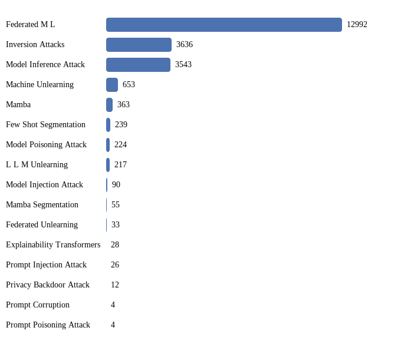

# Research Topics

    

<!--   -->

 

## Venues Covered

         

 

   

   

   

  

    

> More Venues will be added gradually!
> For suggestion of papers or venues not listed here, kindly create an issue on the repository following the appropriate issue template.
> For suggestion of new research topic to be listed, kindly create an issue on the repository following the appropriate issue template.

## Topics by Paper Volume

<!-- START:TOC -->
## Table of Contents

<strong>[Federated ML](https://sadimanna.github.io/awesome-topics/federatedml)</strong>

  
[IJCAI](https://sadimanna.github.io/awesome-topics/federatedml#ijcai)

  - [2025](https://sadimanna.github.io/awesome-topics/federatedml#ijcai-2025)
  - [2024](https://sadimanna.github.io/awesome-topics/federatedml#ijcai-2024)
  - [2023](https://sadimanna.github.io/awesome-topics/federatedml#ijcai-2023)
  - [2022](https://sadimanna.github.io/awesome-topics/federatedml#ijcai-2022)
  - [2021](https://sadimanna.github.io/awesome-topics/federatedml#ijcai-2021)
  - [2020](https://sadimanna.github.io/awesome-topics/federatedml#ijcai-2020)
  - [2019](https://sadimanna.github.io/awesome-topics/federatedml#ijcai-2019)
  

  
[AAAI](https://sadimanna.github.io/awesome-topics/federatedml#aaai)

  - [2025](https://sadimanna.github.io/awesome-topics/federatedml#aaai-2025)
  - [2024](https://sadimanna.github.io/awesome-topics/federatedml#aaai-2024)
  - [2023](https://sadimanna.github.io/awesome-topics/federatedml#aaai-2023)
  - [2022](https://sadimanna.github.io/awesome-topics/federatedml#aaai-2022)
  - [2021](https://sadimanna.github.io/awesome-topics/federatedml#aaai-2021)
  - [2020](https://sadimanna.github.io/awesome-topics/federatedml#aaai-2020)
  - [2011](https://sadimanna.github.io/awesome-topics/federatedml#aaai-2011)
  

  
[AISTATS](https://sadimanna.github.io/awesome-topics/federatedml#aistats)

  - [2025](https://sadimanna.github.io/awesome-topics/federatedml#aistats-2025)
  - [2024](https://sadimanna.github.io/awesome-topics/federatedml#aistats-2024)
  - [2023](https://sadimanna.github.io/awesome-topics/federatedml#aistats-2023)
  - [2022](https://sadimanna.github.io/awesome-topics/federatedml#aistats-2022)
  - [2021](https://sadimanna.github.io/awesome-topics/federatedml#aistats-2021)
  - [2020](https://sadimanna.github.io/awesome-topics/federatedml#aistats-2020)
  

  
[ALT](https://sadimanna.github.io/awesome-topics/federatedml#alt)

  - [2022](https://sadimanna.github.io/awesome-topics/federatedml#alt-2022)
  

  
[Artif. Intell.](https://sadimanna.github.io/awesome-topics/federatedml#artif. intell.)

  - [2025](https://sadimanna.github.io/awesome-topics/federatedml#artif. intell.-2025)
  - [2023](https://sadimanna.github.io/awesome-topics/federatedml#artif. intell.-2023)
  

  
[NeurIPS](https://sadimanna.github.io/awesome-topics/federatedml#neurips)

  - [2024](https://sadimanna.github.io/awesome-topics/federatedml#neurips-2024)
  - [2023](https://sadimanna.github.io/awesome-topics/federatedml#neurips-2023)
  - [2022](https://sadimanna.github.io/awesome-topics/federatedml#neurips-2022)
  - [2021](https://sadimanna.github.io/awesome-topics/federatedml#neurips-2021)
  - [2020](https://sadimanna.github.io/awesome-topics/federatedml#neurips-2020)
  

  
[ICML](https://sadimanna.github.io/awesome-topics/federatedml#icml)

  - [2025](https://sadimanna.github.io/awesome-topics/federatedml#icml-2025)
  - [2024](https://sadimanna.github.io/awesome-topics/federatedml#icml-2024)
  - [2023](https://sadimanna.github.io/awesome-topics/federatedml#icml-2023)
  - [2022](https://sadimanna.github.io/awesome-topics/federatedml#icml-2022)
  - [2021](https://sadimanna.github.io/awesome-topics/federatedml#icml-2021)
  - [2020](https://sadimanna.github.io/awesome-topics/federatedml#icml-2020)
  - [2019](https://sadimanna.github.io/awesome-topics/federatedml#icml-2019)
  

  
[ICLR](https://sadimanna.github.io/awesome-topics/federatedml#iclr)

  - [2025](https://sadimanna.github.io/awesome-topics/federatedml#iclr-2025)
  - [2024](https://sadimanna.github.io/awesome-topics/federatedml#iclr-2024)
  - [2023](https://sadimanna.github.io/awesome-topics/federatedml#iclr-2023)
  - [2022](https://sadimanna.github.io/awesome-topics/federatedml#iclr-2022)
  - [2021](https://sadimanna.github.io/awesome-topics/federatedml#iclr-2021)
  - [2020](https://sadimanna.github.io/awesome-topics/federatedml#iclr-2020)
  

  
[COLT](https://sadimanna.github.io/awesome-topics/federatedml#colt)

  - [2023](https://sadimanna.github.io/awesome-topics/federatedml#colt-2023)
  

  
[UAI](https://sadimanna.github.io/awesome-topics/federatedml#uai)

  - [2025](https://sadimanna.github.io/awesome-topics/federatedml#uai-2025)
  - [2024](https://sadimanna.github.io/awesome-topics/federatedml#uai-2024)
  - [2023](https://sadimanna.github.io/awesome-topics/federatedml#uai-2023)
  - [2022](https://sadimanna.github.io/awesome-topics/federatedml#uai-2022)
  - [2021](https://sadimanna.github.io/awesome-topics/federatedml#uai-2021)
  

  
[Mach. Learn.](https://sadimanna.github.io/awesome-topics/federatedml#mach. learn.)

  - [2025](https://sadimanna.github.io/awesome-topics/federatedml#mach. learn.-2025)
  - [2024](https://sadimanna.github.io/awesome-topics/federatedml#mach. learn.-2024)
  - [2023](https://sadimanna.github.io/awesome-topics/federatedml#mach. learn.-2023)
  - [2022](https://sadimanna.github.io/awesome-topics/federatedml#mach. learn.-2022)
  

  
[J. Mach. Learn. Res.](https://sadimanna.github.io/awesome-topics/federatedml#j. mach. learn. res.)

  - [2024](https://sadimanna.github.io/awesome-topics/federatedml#j. mach. learn. res.-2024)
  - [2023](https://sadimanna.github.io/awesome-topics/federatedml#j. mach. learn. res.-2023)
  - [2021](https://sadimanna.github.io/awesome-topics/federatedml#j. mach. learn. res.-2021)
  

  
[IEEE Trans. Pattern Anal. Mach. Intell.](https://sadimanna.github.io/awesome-topics/federatedml#ieee trans. pattern anal. mach. intell.)

  - [2025](https://sadimanna.github.io/awesome-topics/federatedml#ieee trans. pattern anal. mach. intell.-2025)
  - [2024](https://sadimanna.github.io/awesome-topics/federatedml#ieee trans. pattern anal. mach. intell.-2024)
  - [2023](https://sadimanna.github.io/awesome-topics/federatedml#ieee trans. pattern anal. mach. intell.-2023)
  - [2022](https://sadimanna.github.io/awesome-topics/federatedml#ieee trans. pattern anal. mach. intell.-2022)
  

  
[KDD](https://sadimanna.github.io/awesome-topics/federatedml#kdd)

  - [2025](https://sadimanna.github.io/awesome-topics/federatedml#kdd-2025)
  - [2024](https://sadimanna.github.io/awesome-topics/federatedml#kdd-2024)
  - [2023](https://sadimanna.github.io/awesome-topics/federatedml#kdd-2023)
  - [2022](https://sadimanna.github.io/awesome-topics/federatedml#kdd-2022)
  - [2021](https://sadimanna.github.io/awesome-topics/federatedml#kdd-2021)
  - [2020](https://sadimanna.github.io/awesome-topics/federatedml#kdd-2020)
  - [2017](https://sadimanna.github.io/awesome-topics/federatedml#kdd-2017)
  

  
[WSDM](https://sadimanna.github.io/awesome-topics/federatedml#wsdm)

  - [2025](https://sadimanna.github.io/awesome-topics/federatedml#wsdm-2025)
  - [2024](https://sadimanna.github.io/awesome-topics/federatedml#wsdm-2024)
  - [2023](https://sadimanna.github.io/awesome-topics/federatedml#wsdm-2023)
  - [2022](https://sadimanna.github.io/awesome-topics/federatedml#wsdm-2022)
  - [2021](https://sadimanna.github.io/awesome-topics/federatedml#wsdm-2021)
  - [2019](https://sadimanna.github.io/awesome-topics/federatedml#wsdm-2019)
  - [2012](https://sadimanna.github.io/awesome-topics/federatedml#wsdm-2012)
  - [2011](https://sadimanna.github.io/awesome-topics/federatedml#wsdm-2011)
  

  
[SP](https://sadimanna.github.io/awesome-topics/federatedml#sp)

  - [2025](https://sadimanna.github.io/awesome-topics/federatedml#sp-2025)
  - [2024](https://sadimanna.github.io/awesome-topics/federatedml#sp-2024)
  - [2023](https://sadimanna.github.io/awesome-topics/federatedml#sp-2023)
  - [2022](https://sadimanna.github.io/awesome-topics/federatedml#sp-2022)
  - [2021](https://sadimanna.github.io/awesome-topics/federatedml#sp-2021)
  

  
[IEEE Symposium on Security and Privacy Workshops](https://sadimanna.github.io/awesome-topics/federatedml#ieee symposium on security and privacy workshops)

  - [2019](https://sadimanna.github.io/awesome-topics/federatedml#ieee symposium on security and privacy workshops-2019)
  - [2015](https://sadimanna.github.io/awesome-topics/federatedml#ieee symposium on security and privacy workshops-2015)
  

  
[IEEE Symposium on Security and Privacy](https://sadimanna.github.io/awesome-topics/federatedml#ieee symposium on security and privacy)

  - [2019](https://sadimanna.github.io/awesome-topics/federatedml#ieee symposium on security and privacy-2019)
  

  
[CCS](https://sadimanna.github.io/awesome-topics/federatedml#ccs)

  - [2025](https://sadimanna.github.io/awesome-topics/federatedml#ccs-2025)
  - [2024](https://sadimanna.github.io/awesome-topics/federatedml#ccs-2024)
  - [2023](https://sadimanna.github.io/awesome-topics/federatedml#ccs-2023)
  - [2022](https://sadimanna.github.io/awesome-topics/federatedml#ccs-2022)
  - [2021](https://sadimanna.github.io/awesome-topics/federatedml#ccs-2021)
  - [2019](https://sadimanna.github.io/awesome-topics/federatedml#ccs-2019)
  

  
[USENIX Security Symposium](https://sadimanna.github.io/awesome-topics/federatedml#usenix security symposium)

  - [2025](https://sadimanna.github.io/awesome-topics/federatedml#usenix security symposium-2025)
  - [2024](https://sadimanna.github.io/awesome-topics/federatedml#usenix security symposium-2024)
  - [2023](https://sadimanna.github.io/awesome-topics/federatedml#usenix security symposium-2023)
  - [2022](https://sadimanna.github.io/awesome-topics/federatedml#usenix security symposium-2022)
  - [2020](https://sadimanna.github.io/awesome-topics/federatedml#usenix security symposium-2020)
  

  
[CSET @ USENIX Security Symposium](https://sadimanna.github.io/awesome-topics/federatedml#cset @ usenix security symposium)

  - [2019](https://sadimanna.github.io/awesome-topics/federatedml#cset @ usenix security symposium-2019)
  

  
[NDSS](https://sadimanna.github.io/awesome-topics/federatedml#ndss)

  - [2025](https://sadimanna.github.io/awesome-topics/federatedml#ndss-2025)
  - [2024](https://sadimanna.github.io/awesome-topics/federatedml#ndss-2024)
  - [2023](https://sadimanna.github.io/awesome-topics/federatedml#ndss-2023)
  - [2022](https://sadimanna.github.io/awesome-topics/federatedml#ndss-2022)
  - [2021](https://sadimanna.github.io/awesome-topics/federatedml#ndss-2021)
  - [2020](https://sadimanna.github.io/awesome-topics/federatedml#ndss-2020)
  - [2014](https://sadimanna.github.io/awesome-topics/federatedml#ndss-2014)
  

  
[CVPR](https://sadimanna.github.io/awesome-topics/federatedml#cvpr)

  - [2025](https://sadimanna.github.io/awesome-topics/federatedml#cvpr-2025)
  - [2024](https://sadimanna.github.io/awesome-topics/federatedml#cvpr-2024)
  - [2023](https://sadimanna.github.io/awesome-topics/federatedml#cvpr-2023)
  - [2022](https://sadimanna.github.io/awesome-topics/federatedml#cvpr-2022)
  - [2021](https://sadimanna.github.io/awesome-topics/federatedml#cvpr-2021)
  

  
[ICCV](https://sadimanna.github.io/awesome-topics/federatedml#iccv)

  - [2023](https://sadimanna.github.io/awesome-topics/federatedml#iccv-2023)
  - [2021](https://sadimanna.github.io/awesome-topics/federatedml#iccv-2021)
  

  
[ECCV](https://sadimanna.github.io/awesome-topics/federatedml#eccv)

  - [2024](https://sadimanna.github.io/awesome-topics/federatedml#eccv-2024)
  - [2022](https://sadimanna.github.io/awesome-topics/federatedml#eccv-2022)
  - [2020](https://sadimanna.github.io/awesome-topics/federatedml#eccv-2020)
  

  
[ACM Multimedia](https://sadimanna.github.io/awesome-topics/federatedml#acm multimedia)

  - [2024](https://sadimanna.github.io/awesome-topics/federatedml#acm multimedia-2024)
  - [2023](https://sadimanna.github.io/awesome-topics/federatedml#acm multimedia-2023)
  - [2022](https://sadimanna.github.io/awesome-topics/federatedml#acm multimedia-2022)
  - [2021](https://sadimanna.github.io/awesome-topics/federatedml#acm multimedia-2021)
  - [2020](https://sadimanna.github.io/awesome-topics/federatedml#acm multimedia-2020)
  - [1999](https://sadimanna.github.io/awesome-topics/federatedml#acm multimedia-1999)
  

  
[Int. J. Comput. Vis.](https://sadimanna.github.io/awesome-topics/federatedml#int. j. comput. vis.)

  - [2025](https://sadimanna.github.io/awesome-topics/federatedml#int. j. comput. vis.-2025)
  - [2024](https://sadimanna.github.io/awesome-topics/federatedml#int. j. comput. vis.-2024)
  

  
[ACL](https://sadimanna.github.io/awesome-topics/federatedml#acl)

  - [2025](https://sadimanna.github.io/awesome-topics/federatedml#acl-2025)
  - [2024](https://sadimanna.github.io/awesome-topics/federatedml#acl-2024)
  - [2023](https://sadimanna.github.io/awesome-topics/federatedml#acl-2023)
  

  
[NAACL-HLT](https://sadimanna.github.io/awesome-topics/federatedml#naacl-hlt)

  - [2024](https://sadimanna.github.io/awesome-topics/federatedml#naacl-hlt-2024)
  - [2022](https://sadimanna.github.io/awesome-topics/federatedml#naacl-hlt-2022)
  

  
[EMNLP](https://sadimanna.github.io/awesome-topics/federatedml#emnlp)

  - [2024](https://sadimanna.github.io/awesome-topics/federatedml#emnlp-2024)
  - [2023](https://sadimanna.github.io/awesome-topics/federatedml#emnlp-2023)
  - [2022](https://sadimanna.github.io/awesome-topics/federatedml#emnlp-2022)
  - [2021](https://sadimanna.github.io/awesome-topics/federatedml#emnlp-2021)
  - [2020](https://sadimanna.github.io/awesome-topics/federatedml#emnlp-2020)
  

  
[COLING](https://sadimanna.github.io/awesome-topics/federatedml#coling)

  - [2025](https://sadimanna.github.io/awesome-topics/federatedml#coling-2025)
  - [2020](https://sadimanna.github.io/awesome-topics/federatedml#coling-2020)
  

  
[SIGIR](https://sadimanna.github.io/awesome-topics/federatedml#sigir)

  - [2025](https://sadimanna.github.io/awesome-topics/federatedml#sigir-2025)
  - [2024](https://sadimanna.github.io/awesome-topics/federatedml#sigir-2024)
  - [2023](https://sadimanna.github.io/awesome-topics/federatedml#sigir-2023)
  - [2022](https://sadimanna.github.io/awesome-topics/federatedml#sigir-2022)
  - [2021](https://sadimanna.github.io/awesome-topics/federatedml#sigir-2021)
  - [2020](https://sadimanna.github.io/awesome-topics/federatedml#sigir-2020)
  - [2013](https://sadimanna.github.io/awesome-topics/federatedml#sigir-2013)
  - [2012](https://sadimanna.github.io/awesome-topics/federatedml#sigir-2012)
  - [2011](https://sadimanna.github.io/awesome-topics/federatedml#sigir-2011)
  - [2010](https://sadimanna.github.io/awesome-topics/federatedml#sigir-2010)
  - [2009](https://sadimanna.github.io/awesome-topics/federatedml#sigir-2009)
  - [2007](https://sadimanna.github.io/awesome-topics/federatedml#sigir-2007)
  - [2006](https://sadimanna.github.io/awesome-topics/federatedml#sigir-2006)
  - [2005](https://sadimanna.github.io/awesome-topics/federatedml#sigir-2005)
  - [2004](https://sadimanna.github.io/awesome-topics/federatedml#sigir-2004)
  

  
[Proc. ACM Manag. Data](https://sadimanna.github.io/awesome-topics/federatedml#proc. acm manag. data)

  - [2025](https://sadimanna.github.io/awesome-topics/federatedml#proc. acm manag. data-2025)
  - [2024](https://sadimanna.github.io/awesome-topics/federatedml#proc. acm manag. data-2024)
  - [2023](https://sadimanna.github.io/awesome-topics/federatedml#proc. acm manag. data-2023)
  

  
[SIGMOD Conference](https://sadimanna.github.io/awesome-topics/federatedml#sigmod conference)

  - [2022](https://sadimanna.github.io/awesome-topics/federatedml#sigmod conference-2022)
  - [2021](https://sadimanna.github.io/awesome-topics/federatedml#sigmod conference-2021)
  - [2016](https://sadimanna.github.io/awesome-topics/federatedml#sigmod conference-2016)
  - [2005](https://sadimanna.github.io/awesome-topics/federatedml#sigmod conference-2005)
  - [2002](https://sadimanna.github.io/awesome-topics/federatedml#sigmod conference-2002)
  - [1995](https://sadimanna.github.io/awesome-topics/federatedml#sigmod conference-1995)
  - [1994](https://sadimanna.github.io/awesome-topics/federatedml#sigmod conference-1994)
  - [1993](https://sadimanna.github.io/awesome-topics/federatedml#sigmod conference-1993)
  

  
[ICDE](https://sadimanna.github.io/awesome-topics/federatedml#icde)

  - [2025](https://sadimanna.github.io/awesome-topics/federatedml#icde-2025)
  - [2024](https://sadimanna.github.io/awesome-topics/federatedml#icde-2024)
  - [2023](https://sadimanna.github.io/awesome-topics/federatedml#icde-2023)
  - [2022](https://sadimanna.github.io/awesome-topics/federatedml#icde-2022)
  - [2021](https://sadimanna.github.io/awesome-topics/federatedml#icde-2021)
  - [2010](https://sadimanna.github.io/awesome-topics/federatedml#icde-2010)
  - [2002](https://sadimanna.github.io/awesome-topics/federatedml#icde-2002)
  - [1997](https://sadimanna.github.io/awesome-topics/federatedml#icde-1997)
  - [1995](https://sadimanna.github.io/awesome-topics/federatedml#icde-1995)
  - [1994](https://sadimanna.github.io/awesome-topics/federatedml#icde-1994)
  - [1993](https://sadimanna.github.io/awesome-topics/federatedml#icde-1993)
  - [1989](https://sadimanna.github.io/awesome-topics/federatedml#icde-1989)
  - [1987](https://sadimanna.github.io/awesome-topics/federatedml#icde-1987)
  

  
[Proc. VLDB Endow.](https://sadimanna.github.io/awesome-topics/federatedml#proc. vldb endow.)

  - [2025](https://sadimanna.github.io/awesome-topics/federatedml#proc. vldb endow.-2025)
  - [2024](https://sadimanna.github.io/awesome-topics/federatedml#proc. vldb endow.-2024)
  - [2023](https://sadimanna.github.io/awesome-topics/federatedml#proc. vldb endow.-2023)
  - [2022](https://sadimanna.github.io/awesome-topics/federatedml#proc. vldb endow.-2022)
  - [2021](https://sadimanna.github.io/awesome-topics/federatedml#proc. vldb endow.-2021)
  - [2020](https://sadimanna.github.io/awesome-topics/federatedml#proc. vldb endow.-2020)
  - [2008](https://sadimanna.github.io/awesome-topics/federatedml#proc. vldb endow.-2008)
  

  
[SIGCOMM](https://sadimanna.github.io/awesome-topics/federatedml#sigcomm)

  - [2025](https://sadimanna.github.io/awesome-topics/federatedml#sigcomm-2025)
  - [2024](https://sadimanna.github.io/awesome-topics/federatedml#sigcomm-2024)
  - [2015](https://sadimanna.github.io/awesome-topics/federatedml#sigcomm-2015)
  - [2011](https://sadimanna.github.io/awesome-topics/federatedml#sigcomm-2011)
  

  
[INFOCOM](https://sadimanna.github.io/awesome-topics/federatedml#infocom)

  - [2025](https://sadimanna.github.io/awesome-topics/federatedml#infocom-2025)
  - [2024](https://sadimanna.github.io/awesome-topics/federatedml#infocom-2024)
  - [2023](https://sadimanna.github.io/awesome-topics/federatedml#infocom-2023)
  - [2022](https://sadimanna.github.io/awesome-topics/federatedml#infocom-2022)
  - [2021](https://sadimanna.github.io/awesome-topics/federatedml#infocom-2021)
  - [2020](https://sadimanna.github.io/awesome-topics/federatedml#infocom-2020)
  - [2019](https://sadimanna.github.io/awesome-topics/federatedml#infocom-2019)
  - [2015](https://sadimanna.github.io/awesome-topics/federatedml#infocom-2015)
  - [2009](https://sadimanna.github.io/awesome-topics/federatedml#infocom-2009)
  

  
[MobiCom](https://sadimanna.github.io/awesome-topics/federatedml#mobicom)

  - [2024](https://sadimanna.github.io/awesome-topics/federatedml#mobicom-2024)
  - [2023](https://sadimanna.github.io/awesome-topics/federatedml#mobicom-2023)
  - [2022](https://sadimanna.github.io/awesome-topics/federatedml#mobicom-2022)
  - [2021](https://sadimanna.github.io/awesome-topics/federatedml#mobicom-2021)
  - [2020](https://sadimanna.github.io/awesome-topics/federatedml#mobicom-2020)
  - [2013](https://sadimanna.github.io/awesome-topics/federatedml#mobicom-2013)
  

  
[NSDI](https://sadimanna.github.io/awesome-topics/federatedml#nsdi)

  - [2025](https://sadimanna.github.io/awesome-topics/federatedml#nsdi-2025)
  - [2023](https://sadimanna.github.io/awesome-topics/federatedml#nsdi-2023)
  - [2019](https://sadimanna.github.io/awesome-topics/federatedml#nsdi-2019)
  - [2004](https://sadimanna.github.io/awesome-topics/federatedml#nsdi-2004)
  

  
[WWW](https://sadimanna.github.io/awesome-topics/federatedml#www)

  - [2025](https://sadimanna.github.io/awesome-topics/federatedml#www-2025)
  - [2024](https://sadimanna.github.io/awesome-topics/federatedml#www-2024)
  - [2023](https://sadimanna.github.io/awesome-topics/federatedml#www-2023)
  - [2022](https://sadimanna.github.io/awesome-topics/federatedml#www-2022)
  - [2021](https://sadimanna.github.io/awesome-topics/federatedml#www-2021)
  - [2018](https://sadimanna.github.io/awesome-topics/federatedml#www-2018)
  - [2016](https://sadimanna.github.io/awesome-topics/federatedml#www-2016)
  - [2015](https://sadimanna.github.io/awesome-topics/federatedml#www-2015)
  - [2012](https://sadimanna.github.io/awesome-topics/federatedml#www-2012)
  - [2011](https://sadimanna.github.io/awesome-topics/federatedml#www-2011)
  - [2006](https://sadimanna.github.io/awesome-topics/federatedml#www-2006)
  - [2005](https://sadimanna.github.io/awesome-topics/federatedml#www-2005)
  

  
[OSDI](https://sadimanna.github.io/awesome-topics/federatedml#osdi)

  - [2021](https://sadimanna.github.io/awesome-topics/federatedml#osdi-2021)
  - [2002](https://sadimanna.github.io/awesome-topics/federatedml#osdi-2002)
  

  
[SOSP](https://sadimanna.github.io/awesome-topics/federatedml#sosp)

  - [2023](https://sadimanna.github.io/awesome-topics/federatedml#sosp-2023)
  - [2005](https://sadimanna.github.io/awesome-topics/federatedml#sosp-2005)
  

  
[ISCA](https://sadimanna.github.io/awesome-topics/federatedml#isca)

  - [2024](https://sadimanna.github.io/awesome-topics/federatedml#isca-2024)
  

  
[MLSys](https://sadimanna.github.io/awesome-topics/federatedml#mlsys)

  - [2024](https://sadimanna.github.io/awesome-topics/federatedml#mlsys-2024)
  - [2023](https://sadimanna.github.io/awesome-topics/federatedml#mlsys-2023)
  - [2022](https://sadimanna.github.io/awesome-topics/federatedml#mlsys-2022)
  - [2020](https://sadimanna.github.io/awesome-topics/federatedml#mlsys-2020)
  

  
[EuroSys](https://sadimanna.github.io/awesome-topics/federatedml#eurosys)

  - [2025](https://sadimanna.github.io/awesome-topics/federatedml#eurosys-2025)
  - [2024](https://sadimanna.github.io/awesome-topics/federatedml#eurosys-2024)
  - [2023](https://sadimanna.github.io/awesome-topics/federatedml#eurosys-2023)
  

  
[IEEE Trans. Parallel Distributed Syst.](https://sadimanna.github.io/awesome-topics/federatedml#ieee trans. parallel distributed syst.)

  - [2025](https://sadimanna.github.io/awesome-topics/federatedml#ieee trans. parallel distributed syst.-2025)
  - [2024](https://sadimanna.github.io/awesome-topics/federatedml#ieee trans. parallel distributed syst.-2024)
  - [2023](https://sadimanna.github.io/awesome-topics/federatedml#ieee trans. parallel distributed syst.-2023)
  - [2022](https://sadimanna.github.io/awesome-topics/federatedml#ieee trans. parallel distributed syst.-2022)
  - [2021](https://sadimanna.github.io/awesome-topics/federatedml#ieee trans. parallel distributed syst.-2021)
  - [2020](https://sadimanna.github.io/awesome-topics/federatedml#ieee trans. parallel distributed syst.-2020)
  - [2013](https://sadimanna.github.io/awesome-topics/federatedml#ieee trans. parallel distributed syst.-2013)
  

  
[DAC](https://sadimanna.github.io/awesome-topics/federatedml#dac)

  - [2025](https://sadimanna.github.io/awesome-topics/federatedml#dac-2025)
  - [2024](https://sadimanna.github.io/awesome-topics/federatedml#dac-2024)
  - [2022](https://sadimanna.github.io/awesome-topics/federatedml#dac-2022)
  - [2021](https://sadimanna.github.io/awesome-topics/federatedml#dac-2021)
  - [2014](https://sadimanna.github.io/awesome-topics/federatedml#dac-2014)
  

  
[ACM Trans. Storage](https://sadimanna.github.io/awesome-topics/federatedml#acm trans. storage)

  - [2021](https://sadimanna.github.io/awesome-topics/federatedml#acm trans. storage-2021)
  

  
[IEEE Trans. Comput. Aided Des. Integr. Circuits Syst.](https://sadimanna.github.io/awesome-topics/federatedml#ieee trans. comput. aided des. integr. circuits syst.)

  - [2025](https://sadimanna.github.io/awesome-topics/federatedml#ieee trans. comput. aided des. integr. circuits syst.-2025)
  - [2024](https://sadimanna.github.io/awesome-topics/federatedml#ieee trans. comput. aided des. integr. circuits syst.-2024)
  - [2023](https://sadimanna.github.io/awesome-topics/federatedml#ieee trans. comput. aided des. integr. circuits syst.-2023)
  - [2022](https://sadimanna.github.io/awesome-topics/federatedml#ieee trans. comput. aided des. integr. circuits syst.-2022)
  - [2021](https://sadimanna.github.io/awesome-topics/federatedml#ieee trans. comput. aided des. integr. circuits syst.-2021)
  - [2009](https://sadimanna.github.io/awesome-topics/federatedml#ieee trans. comput. aided des. integr. circuits syst.-2009)
  

  
[IEEE Trans. Computers](https://sadimanna.github.io/awesome-topics/federatedml#ieee trans. computers)

  - [2025](https://sadimanna.github.io/awesome-topics/federatedml#ieee trans. computers-2025)
  - [2024](https://sadimanna.github.io/awesome-topics/federatedml#ieee trans. computers-2024)
  - [2023](https://sadimanna.github.io/awesome-topics/federatedml#ieee trans. computers-2023)
  - [2022](https://sadimanna.github.io/awesome-topics/federatedml#ieee trans. computers-2022)
  - [2021](https://sadimanna.github.io/awesome-topics/federatedml#ieee trans. computers-2021)
  

  
[SVM@ICSE](https://sadimanna.github.io/awesome-topics/federatedml#svm@icse)

  - [2025](https://sadimanna.github.io/awesome-topics/federatedml#svm@icse-2025)
  

  
[ICSE](https://sadimanna.github.io/awesome-topics/federatedml#icse)

  - [2025](https://sadimanna.github.io/awesome-topics/federatedml#icse-2025)
  - [2023](https://sadimanna.github.io/awesome-topics/federatedml#icse-2023)
  - [2012](https://sadimanna.github.io/awesome-topics/federatedml#icse-2012)
  

  
[SEiGS@ICSE](https://sadimanna.github.io/awesome-topics/federatedml#seigs@icse)

  - [2025](https://sadimanna.github.io/awesome-topics/federatedml#seigs@icse-2025)
  

  
[ICSE Companion](https://sadimanna.github.io/awesome-topics/federatedml#icse companion)

  - [2024](https://sadimanna.github.io/awesome-topics/federatedml#icse companion-2024)
  

  
[WACV](https://sadimanna.github.io/awesome-topics/federatedml#wacv)

  - [2025](https://sadimanna.github.io/awesome-topics/federatedml#wacv-2025)
  - [2024](https://sadimanna.github.io/awesome-topics/federatedml#wacv-2024)
  - [2023](https://sadimanna.github.io/awesome-topics/federatedml#wacv-2023)
  - [2022](https://sadimanna.github.io/awesome-topics/federatedml#wacv-2022)
  

<strong>[Inversion Attacks](https://sadimanna.github.io/awesome-topics/inversion-attacks)</strong>

  
[IJCAI](https://sadimanna.github.io/awesome-topics/inversion-attacks#ijcai)

  - [2025](https://sadimanna.github.io/awesome-topics/inversion-attacks#ijcai-2025)
  - [2022](https://sadimanna.github.io/awesome-topics/inversion-attacks#ijcai-2022)
  - [2021](https://sadimanna.github.io/awesome-topics/inversion-attacks#ijcai-2021)
  - [2015](https://sadimanna.github.io/awesome-topics/inversion-attacks#ijcai-2015)
  

  
[AAAI](https://sadimanna.github.io/awesome-topics/inversion-attacks#aaai)

  - [2025](https://sadimanna.github.io/awesome-topics/inversion-attacks#aaai-2025)
  - [2024](https://sadimanna.github.io/awesome-topics/inversion-attacks#aaai-2024)
  - [2023](https://sadimanna.github.io/awesome-topics/inversion-attacks#aaai-2023)
  - [2021](https://sadimanna.github.io/awesome-topics/inversion-attacks#aaai-2021)
  

  
[AISTATS](https://sadimanna.github.io/awesome-topics/inversion-attacks#aistats)

  - [2025](https://sadimanna.github.io/awesome-topics/inversion-attacks#aistats-2025)
  

  
[NeurIPS](https://sadimanna.github.io/awesome-topics/inversion-attacks#neurips)

  - [2024](https://sadimanna.github.io/awesome-topics/inversion-attacks#neurips-2024)
  - [2023](https://sadimanna.github.io/awesome-topics/inversion-attacks#neurips-2023)
  - [2022](https://sadimanna.github.io/awesome-topics/inversion-attacks#neurips-2022)
  - [2021](https://sadimanna.github.io/awesome-topics/inversion-attacks#neurips-2021)
  - [2020](https://sadimanna.github.io/awesome-topics/inversion-attacks#neurips-2020)
  - [2018](https://sadimanna.github.io/awesome-topics/inversion-attacks#neurips-2018)
  

  
[ICML](https://sadimanna.github.io/awesome-topics/inversion-attacks#icml)

  - [2025](https://sadimanna.github.io/awesome-topics/inversion-attacks#icml-2025)
  - [2024](https://sadimanna.github.io/awesome-topics/inversion-attacks#icml-2024)
  - [2022](https://sadimanna.github.io/awesome-topics/inversion-attacks#icml-2022)
  

  
[ICLR](https://sadimanna.github.io/awesome-topics/inversion-attacks#iclr)

  - [2025](https://sadimanna.github.io/awesome-topics/inversion-attacks#iclr-2025)
  - [2024](https://sadimanna.github.io/awesome-topics/inversion-attacks#iclr-2024)
  

  
[UAI](https://sadimanna.github.io/awesome-topics/inversion-attacks#uai)

  - [2023](https://sadimanna.github.io/awesome-topics/inversion-attacks#uai-2023)
  

  
[IEEE Trans. Pattern Anal. Mach. Intell.](https://sadimanna.github.io/awesome-topics/inversion-attacks#ieee trans. pattern anal. mach. intell.)

  - [2025](https://sadimanna.github.io/awesome-topics/inversion-attacks#ieee trans. pattern anal. mach. intell.-2025)
  - [2024](https://sadimanna.github.io/awesome-topics/inversion-attacks#ieee trans. pattern anal. mach. intell.-2024)
  - [2023](https://sadimanna.github.io/awesome-topics/inversion-attacks#ieee trans. pattern anal. mach. intell.-2023)
  

  
[KDD](https://sadimanna.github.io/awesome-topics/inversion-attacks#kdd)

  - [2022](https://sadimanna.github.io/awesome-topics/inversion-attacks#kdd-2022)
  

  
[SP](https://sadimanna.github.io/awesome-topics/inversion-attacks#sp)

  - [2025](https://sadimanna.github.io/awesome-topics/inversion-attacks#sp-2025)
  - [2024](https://sadimanna.github.io/awesome-topics/inversion-attacks#sp-2024)
  

  
[CCS](https://sadimanna.github.io/awesome-topics/inversion-attacks#ccs)

  - [2024](https://sadimanna.github.io/awesome-topics/inversion-attacks#ccs-2024)
  - [2015](https://sadimanna.github.io/awesome-topics/inversion-attacks#ccs-2015)
  

  
[USENIX Security Symposium](https://sadimanna.github.io/awesome-topics/inversion-attacks#usenix security symposium)

  - [2025](https://sadimanna.github.io/awesome-topics/inversion-attacks#usenix security symposium-2025)
  - [2022](https://sadimanna.github.io/awesome-topics/inversion-attacks#usenix security symposium-2022)
  

  
[NDSS](https://sadimanna.github.io/awesome-topics/inversion-attacks#ndss)

  - [2025](https://sadimanna.github.io/awesome-topics/inversion-attacks#ndss-2025)
  - [2024](https://sadimanna.github.io/awesome-topics/inversion-attacks#ndss-2024)
  - [2022](https://sadimanna.github.io/awesome-topics/inversion-attacks#ndss-2022)
  

  
[CVPR](https://sadimanna.github.io/awesome-topics/inversion-attacks#cvpr)

  - [2025](https://sadimanna.github.io/awesome-topics/inversion-attacks#cvpr-2025)
  - [2024](https://sadimanna.github.io/awesome-topics/inversion-attacks#cvpr-2024)
  - [2023](https://sadimanna.github.io/awesome-topics/inversion-attacks#cvpr-2023)
  - [2022](https://sadimanna.github.io/awesome-topics/inversion-attacks#cvpr-2022)
  - [2021](https://sadimanna.github.io/awesome-topics/inversion-attacks#cvpr-2021)
  - [2020](https://sadimanna.github.io/awesome-topics/inversion-attacks#cvpr-2020)
  

  
[ICCV](https://sadimanna.github.io/awesome-topics/inversion-attacks#iccv)

  - [2023](https://sadimanna.github.io/awesome-topics/inversion-attacks#iccv-2023)
  - [2021](https://sadimanna.github.io/awesome-topics/inversion-attacks#iccv-2021)
  

  
[ECCV](https://sadimanna.github.io/awesome-topics/inversion-attacks#eccv)

  - [2024](https://sadimanna.github.io/awesome-topics/inversion-attacks#eccv-2024)
  

  
[ACM Multimedia](https://sadimanna.github.io/awesome-topics/inversion-attacks#acm multimedia)

  - [2023](https://sadimanna.github.io/awesome-topics/inversion-attacks#acm multimedia-2023)
  

  
[ACL](https://sadimanna.github.io/awesome-topics/inversion-attacks#acl)

  - [2025](https://sadimanna.github.io/awesome-topics/inversion-attacks#acl-2025)
  - [2024](https://sadimanna.github.io/awesome-topics/inversion-attacks#acl-2024)
  - [2023](https://sadimanna.github.io/awesome-topics/inversion-attacks#acl-2023)
  

  
[EMNLP](https://sadimanna.github.io/awesome-topics/inversion-attacks#emnlp)

  - [2024](https://sadimanna.github.io/awesome-topics/inversion-attacks#emnlp-2024)
  - [2022](https://sadimanna.github.io/awesome-topics/inversion-attacks#emnlp-2022)
  

  
[COLING](https://sadimanna.github.io/awesome-topics/inversion-attacks#coling)

  - [2025](https://sadimanna.github.io/awesome-topics/inversion-attacks#coling-2025)
  - [2012](https://sadimanna.github.io/awesome-topics/inversion-attacks#coling-2012)
  - [1986](https://sadimanna.github.io/awesome-topics/inversion-attacks#coling-1986)
  

  
[SIGIR](https://sadimanna.github.io/awesome-topics/inversion-attacks#sigir)

  - [2025](https://sadimanna.github.io/awesome-topics/inversion-attacks#sigir-2025)
  

  
[WWW](https://sadimanna.github.io/awesome-topics/inversion-attacks#www)

  - [2023](https://sadimanna.github.io/awesome-topics/inversion-attacks#www-2023)
  

  
[DAC](https://sadimanna.github.io/awesome-topics/inversion-attacks#dac)

  - [2025](https://sadimanna.github.io/awesome-topics/inversion-attacks#dac-2025)
  - [2021](https://sadimanna.github.io/awesome-topics/inversion-attacks#dac-2021)
  

  
[IEEE Trans. Computers](https://sadimanna.github.io/awesome-topics/inversion-attacks#ieee trans. computers)

  - [2000](https://sadimanna.github.io/awesome-topics/inversion-attacks#ieee trans. computers-2000)
  

  
[WACV](https://sadimanna.github.io/awesome-topics/inversion-attacks#wacv)

  - [2025](https://sadimanna.github.io/awesome-topics/inversion-attacks#wacv-2025)
  - [2024](https://sadimanna.github.io/awesome-topics/inversion-attacks#wacv-2024)
  - [2022](https://sadimanna.github.io/awesome-topics/inversion-attacks#wacv-2022)
  

  
[IEEE Trans. Comput. Aided Des. Integr. Circuits Syst.](https://sadimanna.github.io/awesome-topics/inversion-attacks#ieee trans. comput. aided des. integr. circuits syst.)

  - [2000](https://sadimanna.github.io/awesome-topics/inversion-attacks#ieee trans. comput. aided des. integr. circuits syst.-2000)
  - [1992](https://sadimanna.github.io/awesome-topics/inversion-attacks#ieee trans. comput. aided des. integr. circuits syst.-1992)
  - [1989](https://sadimanna.github.io/awesome-topics/inversion-attacks#ieee trans. comput. aided des. integr. circuits syst.-1989)
  

<!-- END:TOC -->

## Disclaimer & Reuse

This repository is intended as a **curated and automated paper-tracking resource** for research topics in Federated Learning and related areas. This repository was forked from [Awesome-FL](https://github.com/youngfish42/Awesome-FL) and then modified in many ways, which I am too lazy to type.

You are **strongly encouraged to fork this repository** and use it for:
- Tracking your own research topics
- Maintaining personalized paper collections
- Running automated updates for new publications

This repository works in conjunction with another repository [dblp-paper-daily](https://github.com/sadimanna/dblp-paper-daily), which was forked from [FL-paper-update-tracker](https://github.com/youngfish42/FL-paper-update-tracker). The mechanism from [dblp-paper-daily](https://github.com/sadimanna/dblp-paper-daily) has already been embedded into this repository which enables automated updated everyday, and generates or updates the corresponding pages topic-wise, and also updates the TOC in the landing page [here](https://sadimanna.github.io/awesome-topics).

If you fork and extend this repository, please consider adding a link back to the original repository for attribution and discoverability.