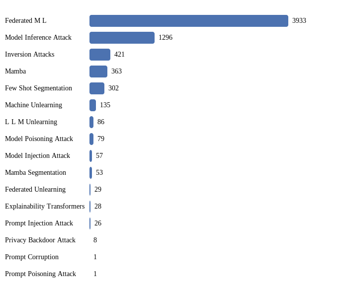

# Research Topics

    

<!--   -->

 

## Venues Covered

         

 

   

   

   

  

    

> More Venues will be added gradually!
> For suggestion of papers or venues not listed here, kindly create an issue on the repository following the appropriate issue template.
> For suggestion of new research topic to be listed, kindly create an issue on the repository following the appropriate issue template.

## Topics by Paper Volume

<!-- START:TOC -->
## Table of Contents

<strong><a href="https://sadimanna.github.io/awesome-topics/federated-m-l">Federated M L</a></strong>

  
<a href="https://sadimanna.github.io/awesome-topics/federated-m-l#ijcai">IJCAI</a>

  - [2025](https://sadimanna.github.io/awesome-topics/federated-m-l#ijcai-2025)
  - [2024](https://sadimanna.github.io/awesome-topics/federated-m-l#ijcai-2024)
  - [2023](https://sadimanna.github.io/awesome-topics/federated-m-l#ijcai-2023)
  - [2022](https://sadimanna.github.io/awesome-topics/federated-m-l#ijcai-2022)
  - [2021](https://sadimanna.github.io/awesome-topics/federated-m-l#ijcai-2021)
  - [2020](https://sadimanna.github.io/awesome-topics/federated-m-l#ijcai-2020)
  - [2019](https://sadimanna.github.io/awesome-topics/federated-m-l#ijcai-2019)
  

  
<a href="https://sadimanna.github.io/awesome-topics/federated-m-l#aaai">AAAI</a>

  - [2025](https://sadimanna.github.io/awesome-topics/federated-m-l#aaai-2025)
  - [2024](https://sadimanna.github.io/awesome-topics/federated-m-l#aaai-2024)
  - [2023](https://sadimanna.github.io/awesome-topics/federated-m-l#aaai-2023)
  - [2022](https://sadimanna.github.io/awesome-topics/federated-m-l#aaai-2022)
  - [2021](https://sadimanna.github.io/awesome-topics/federated-m-l#aaai-2021)
  - [2020](https://sadimanna.github.io/awesome-topics/federated-m-l#aaai-2020)
  - [2011](https://sadimanna.github.io/awesome-topics/federated-m-l#aaai-2011)
  

  
<a href="https://sadimanna.github.io/awesome-topics/federated-m-l#aistats">AISTATS</a>

  - [2025](https://sadimanna.github.io/awesome-topics/federated-m-l#aistats-2025)
  - [2024](https://sadimanna.github.io/awesome-topics/federated-m-l#aistats-2024)
  - [2023](https://sadimanna.github.io/awesome-topics/federated-m-l#aistats-2023)
  - [2022](https://sadimanna.github.io/awesome-topics/federated-m-l#aistats-2022)
  - [2021](https://sadimanna.github.io/awesome-topics/federated-m-l#aistats-2021)
  - [2020](https://sadimanna.github.io/awesome-topics/federated-m-l#aistats-2020)
  

  
<a href="https://sadimanna.github.io/awesome-topics/federated-m-l#alt">ALT</a>

  - [2022](https://sadimanna.github.io/awesome-topics/federated-m-l#alt-2022)
  

  
<a href="https://sadimanna.github.io/awesome-topics/federated-m-l#artif-intell">Artif. Intell.</a>

  - [2025](https://sadimanna.github.io/awesome-topics/federated-m-l#artif. intell.-2025)
  - [2023](https://sadimanna.github.io/awesome-topics/federated-m-l#artif. intell.-2023)
  

  
<a href="https://sadimanna.github.io/awesome-topics/federated-m-l#neurips">NeurIPS</a>

  - [2024](https://sadimanna.github.io/awesome-topics/federated-m-l#neurips-2024)
  - [2023](https://sadimanna.github.io/awesome-topics/federated-m-l#neurips-2023)
  - [2022](https://sadimanna.github.io/awesome-topics/federated-m-l#neurips-2022)
  - [2021](https://sadimanna.github.io/awesome-topics/federated-m-l#neurips-2021)
  - [2020](https://sadimanna.github.io/awesome-topics/federated-m-l#neurips-2020)
  

  
<a href="https://sadimanna.github.io/awesome-topics/federated-m-l#icml">ICML</a>

  - [2025](https://sadimanna.github.io/awesome-topics/federated-m-l#icml-2025)
  - [2024](https://sadimanna.github.io/awesome-topics/federated-m-l#icml-2024)
  - [2023](https://sadimanna.github.io/awesome-topics/federated-m-l#icml-2023)
  - [2022](https://sadimanna.github.io/awesome-topics/federated-m-l#icml-2022)
  - [2021](https://sadimanna.github.io/awesome-topics/federated-m-l#icml-2021)
  - [2020](https://sadimanna.github.io/awesome-topics/federated-m-l#icml-2020)
  - [2019](https://sadimanna.github.io/awesome-topics/federated-m-l#icml-2019)
  

  
<a href="https://sadimanna.github.io/awesome-topics/federated-m-l#iclr">ICLR</a>

  - [2025](https://sadimanna.github.io/awesome-topics/federated-m-l#iclr-2025)
  - [2024](https://sadimanna.github.io/awesome-topics/federated-m-l#iclr-2024)
  - [2023](https://sadimanna.github.io/awesome-topics/federated-m-l#iclr-2023)
  - [2022](https://sadimanna.github.io/awesome-topics/federated-m-l#iclr-2022)
  - [2021](https://sadimanna.github.io/awesome-topics/federated-m-l#iclr-2021)
  - [2020](https://sadimanna.github.io/awesome-topics/federated-m-l#iclr-2020)
  

  
<a href="https://sadimanna.github.io/awesome-topics/federated-m-l#colt">COLT</a>

  - [2023](https://sadimanna.github.io/awesome-topics/federated-m-l#colt-2023)
  

  
<a href="https://sadimanna.github.io/awesome-topics/federated-m-l#uai">UAI</a>

  - [2025](https://sadimanna.github.io/awesome-topics/federated-m-l#uai-2025)
  - [2024](https://sadimanna.github.io/awesome-topics/federated-m-l#uai-2024)
  - [2023](https://sadimanna.github.io/awesome-topics/federated-m-l#uai-2023)
  - [2022](https://sadimanna.github.io/awesome-topics/federated-m-l#uai-2022)
  - [2021](https://sadimanna.github.io/awesome-topics/federated-m-l#uai-2021)
  

  
<a href="https://sadimanna.github.io/awesome-topics/federated-m-l#mach-learn">Mach. Learn.</a>

  - [2025](https://sadimanna.github.io/awesome-topics/federated-m-l#mach. learn.-2025)
  - [2024](https://sadimanna.github.io/awesome-topics/federated-m-l#mach. learn.-2024)
  - [2023](https://sadimanna.github.io/awesome-topics/federated-m-l#mach. learn.-2023)
  - [2022](https://sadimanna.github.io/awesome-topics/federated-m-l#mach. learn.-2022)
  

  
<a href="https://sadimanna.github.io/awesome-topics/federated-m-l#j-mach-learn-res">J. Mach. Learn. Res.</a>

  - [2024](https://sadimanna.github.io/awesome-topics/federated-m-l#j. mach. learn. res.-2024)
  - [2023](https://sadimanna.github.io/awesome-topics/federated-m-l#j. mach. learn. res.-2023)
  - [2021](https://sadimanna.github.io/awesome-topics/federated-m-l#j. mach. learn. res.-2021)
  

  
<a href="https://sadimanna.github.io/awesome-topics/federated-m-l#ieee-trans-pattern-anal-mach-intell">IEEE Trans. Pattern Anal. Mach. Intell.</a>

  - [2025](https://sadimanna.github.io/awesome-topics/federated-m-l#ieee trans. pattern anal. mach. intell.-2025)
  - [2024](https://sadimanna.github.io/awesome-topics/federated-m-l#ieee trans. pattern anal. mach. intell.-2024)
  - [2023](https://sadimanna.github.io/awesome-topics/federated-m-l#ieee trans. pattern anal. mach. intell.-2023)
  - [2022](https://sadimanna.github.io/awesome-topics/federated-m-l#ieee trans. pattern anal. mach. intell.-2022)
  

  
<a href="https://sadimanna.github.io/awesome-topics/federated-m-l#kdd">KDD</a>

  - [2025](https://sadimanna.github.io/awesome-topics/federated-m-l#kdd-2025)
  - [2024](https://sadimanna.github.io/awesome-topics/federated-m-l#kdd-2024)
  - [2023](https://sadimanna.github.io/awesome-topics/federated-m-l#kdd-2023)
  - [2022](https://sadimanna.github.io/awesome-topics/federated-m-l#kdd-2022)
  - [2021](https://sadimanna.github.io/awesome-topics/federated-m-l#kdd-2021)
  - [2020](https://sadimanna.github.io/awesome-topics/federated-m-l#kdd-2020)
  - [2017](https://sadimanna.github.io/awesome-topics/federated-m-l#kdd-2017)
  

  
<a href="https://sadimanna.github.io/awesome-topics/federated-m-l#wsdm">WSDM</a>

  - [2025](https://sadimanna.github.io/awesome-topics/federated-m-l#wsdm-2025)
  - [2024](https://sadimanna.github.io/awesome-topics/federated-m-l#wsdm-2024)
  - [2023](https://sadimanna.github.io/awesome-topics/federated-m-l#wsdm-2023)
  - [2022](https://sadimanna.github.io/awesome-topics/federated-m-l#wsdm-2022)
  - [2021](https://sadimanna.github.io/awesome-topics/federated-m-l#wsdm-2021)
  - [2019](https://sadimanna.github.io/awesome-topics/federated-m-l#wsdm-2019)
  - [2012](https://sadimanna.github.io/awesome-topics/federated-m-l#wsdm-2012)
  - [2011](https://sadimanna.github.io/awesome-topics/federated-m-l#wsdm-2011)
  

  
<a href="https://sadimanna.github.io/awesome-topics/federated-m-l#sp">SP</a>

  - [2025](https://sadimanna.github.io/awesome-topics/federated-m-l#sp-2025)
  - [2024](https://sadimanna.github.io/awesome-topics/federated-m-l#sp-2024)
  - [2023](https://sadimanna.github.io/awesome-topics/federated-m-l#sp-2023)
  - [2022](https://sadimanna.github.io/awesome-topics/federated-m-l#sp-2022)
  - [2021](https://sadimanna.github.io/awesome-topics/federated-m-l#sp-2021)
  

  
<a href="https://sadimanna.github.io/awesome-topics/federated-m-l#ieee-symposium-on-security-and-privacy-workshops">IEEE Symposium on Security and Privacy Workshops</a>

  - [2019](https://sadimanna.github.io/awesome-topics/federated-m-l#ieee symposium on security and privacy workshops-2019)
  - [2015](https://sadimanna.github.io/awesome-topics/federated-m-l#ieee symposium on security and privacy workshops-2015)
  

  
<a href="https://sadimanna.github.io/awesome-topics/federated-m-l#ieee-symposium-on-security-and-privacy">IEEE Symposium on Security and Privacy</a>

  - [2019](https://sadimanna.github.io/awesome-topics/federated-m-l#ieee symposium on security and privacy-2019)
  

  
<a href="https://sadimanna.github.io/awesome-topics/federated-m-l#ccs">CCS</a>

  - [2025](https://sadimanna.github.io/awesome-topics/federated-m-l#ccs-2025)
  - [2024](https://sadimanna.github.io/awesome-topics/federated-m-l#ccs-2024)
  - [2023](https://sadimanna.github.io/awesome-topics/federated-m-l#ccs-2023)
  - [2022](https://sadimanna.github.io/awesome-topics/federated-m-l#ccs-2022)
  - [2021](https://sadimanna.github.io/awesome-topics/federated-m-l#ccs-2021)
  - [2019](https://sadimanna.github.io/awesome-topics/federated-m-l#ccs-2019)
  

  
<a href="https://sadimanna.github.io/awesome-topics/federated-m-l#usenix-security-symposium">USENIX Security Symposium</a>

  - [2025](https://sadimanna.github.io/awesome-topics/federated-m-l#usenix security symposium-2025)
  - [2024](https://sadimanna.github.io/awesome-topics/federated-m-l#usenix security symposium-2024)
  - [2023](https://sadimanna.github.io/awesome-topics/federated-m-l#usenix security symposium-2023)
  - [2022](https://sadimanna.github.io/awesome-topics/federated-m-l#usenix security symposium-2022)
  - [2020](https://sadimanna.github.io/awesome-topics/federated-m-l#usenix security symposium-2020)
  

  
<a href="https://sadimanna.github.io/awesome-topics/federated-m-l#cset-usenix-security-symposium">CSET @ USENIX Security Symposium</a>

  - [2019](https://sadimanna.github.io/awesome-topics/federated-m-l#cset @ usenix security symposium-2019)
  

  
<a href="https://sadimanna.github.io/awesome-topics/federated-m-l#ndss">NDSS</a>

  - [2025](https://sadimanna.github.io/awesome-topics/federated-m-l#ndss-2025)
  - [2024](https://sadimanna.github.io/awesome-topics/federated-m-l#ndss-2024)
  - [2023](https://sadimanna.github.io/awesome-topics/federated-m-l#ndss-2023)
  - [2022](https://sadimanna.github.io/awesome-topics/federated-m-l#ndss-2022)
  - [2021](https://sadimanna.github.io/awesome-topics/federated-m-l#ndss-2021)
  - [2020](https://sadimanna.github.io/awesome-topics/federated-m-l#ndss-2020)
  - [2014](https://sadimanna.github.io/awesome-topics/federated-m-l#ndss-2014)
  

  
<a href="https://sadimanna.github.io/awesome-topics/federated-m-l#cvpr">CVPR</a>

  - [2025](https://sadimanna.github.io/awesome-topics/federated-m-l#cvpr-2025)
  - [2024](https://sadimanna.github.io/awesome-topics/federated-m-l#cvpr-2024)
  - [2023](https://sadimanna.github.io/awesome-topics/federated-m-l#cvpr-2023)
  - [2022](https://sadimanna.github.io/awesome-topics/federated-m-l#cvpr-2022)
  - [2021](https://sadimanna.github.io/awesome-topics/federated-m-l#cvpr-2021)
  

  
<a href="https://sadimanna.github.io/awesome-topics/federated-m-l#iccv">ICCV</a>

  - [2023](https://sadimanna.github.io/awesome-topics/federated-m-l#iccv-2023)
  - [2021](https://sadimanna.github.io/awesome-topics/federated-m-l#iccv-2021)
  

  
<a href="https://sadimanna.github.io/awesome-topics/federated-m-l#eccv">ECCV</a>

  - [2024](https://sadimanna.github.io/awesome-topics/federated-m-l#eccv-2024)
  - [2022](https://sadimanna.github.io/awesome-topics/federated-m-l#eccv-2022)
  - [2020](https://sadimanna.github.io/awesome-topics/federated-m-l#eccv-2020)
  

  
<a href="https://sadimanna.github.io/awesome-topics/federated-m-l#acm-multimedia">ACM Multimedia</a>

  - [2024](https://sadimanna.github.io/awesome-topics/federated-m-l#acm multimedia-2024)
  - [2023](https://sadimanna.github.io/awesome-topics/federated-m-l#acm multimedia-2023)
  - [2022](https://sadimanna.github.io/awesome-topics/federated-m-l#acm multimedia-2022)
  - [2021](https://sadimanna.github.io/awesome-topics/federated-m-l#acm multimedia-2021)
  - [2020](https://sadimanna.github.io/awesome-topics/federated-m-l#acm multimedia-2020)
  - [1999](https://sadimanna.github.io/awesome-topics/federated-m-l#acm multimedia-1999)
  

  
<a href="https://sadimanna.github.io/awesome-topics/federated-m-l#int-j-comput-vis">Int. J. Comput. Vis.</a>

  - [2025](https://sadimanna.github.io/awesome-topics/federated-m-l#int. j. comput. vis.-2025)
  - [2024](https://sadimanna.github.io/awesome-topics/federated-m-l#int. j. comput. vis.-2024)
  

  
<a href="https://sadimanna.github.io/awesome-topics/federated-m-l#acl">ACL</a>

  - [2025](https://sadimanna.github.io/awesome-topics/federated-m-l#acl-2025)
  - [2024](https://sadimanna.github.io/awesome-topics/federated-m-l#acl-2024)
  - [2023](https://sadimanna.github.io/awesome-topics/federated-m-l#acl-2023)
  

  
<a href="https://sadimanna.github.io/awesome-topics/federated-m-l#naacl-hlt">NAACL-HLT</a>

  - [2024](https://sadimanna.github.io/awesome-topics/federated-m-l#naacl-hlt-2024)
  - [2022](https://sadimanna.github.io/awesome-topics/federated-m-l#naacl-hlt-2022)
  

  
<a href="https://sadimanna.github.io/awesome-topics/federated-m-l#emnlp">EMNLP</a>

  - [2024](https://sadimanna.github.io/awesome-topics/federated-m-l#emnlp-2024)
  - [2023](https://sadimanna.github.io/awesome-topics/federated-m-l#emnlp-2023)
  - [2022](https://sadimanna.github.io/awesome-topics/federated-m-l#emnlp-2022)
  - [2021](https://sadimanna.github.io/awesome-topics/federated-m-l#emnlp-2021)
  - [2020](https://sadimanna.github.io/awesome-topics/federated-m-l#emnlp-2020)
  

  
<a href="https://sadimanna.github.io/awesome-topics/federated-m-l#coling">COLING</a>

  - [2025](https://sadimanna.github.io/awesome-topics/federated-m-l#coling-2025)
  - [2020](https://sadimanna.github.io/awesome-topics/federated-m-l#coling-2020)
  

  
<a href="https://sadimanna.github.io/awesome-topics/federated-m-l#sigir">SIGIR</a>

  - [2025](https://sadimanna.github.io/awesome-topics/federated-m-l#sigir-2025)
  - [2024](https://sadimanna.github.io/awesome-topics/federated-m-l#sigir-2024)
  - [2023](https://sadimanna.github.io/awesome-topics/federated-m-l#sigir-2023)
  - [2022](https://sadimanna.github.io/awesome-topics/federated-m-l#sigir-2022)
  - [2021](https://sadimanna.github.io/awesome-topics/federated-m-l#sigir-2021)
  - [2020](https://sadimanna.github.io/awesome-topics/federated-m-l#sigir-2020)
  - [2013](https://sadimanna.github.io/awesome-topics/federated-m-l#sigir-2013)
  - [2012](https://sadimanna.github.io/awesome-topics/federated-m-l#sigir-2012)
  - [2011](https://sadimanna.github.io/awesome-topics/federated-m-l#sigir-2011)
  - [2010](https://sadimanna.github.io/awesome-topics/federated-m-l#sigir-2010)
  - [2009](https://sadimanna.github.io/awesome-topics/federated-m-l#sigir-2009)
  - [2007](https://sadimanna.github.io/awesome-topics/federated-m-l#sigir-2007)
  - [2006](https://sadimanna.github.io/awesome-topics/federated-m-l#sigir-2006)
  - [2005](https://sadimanna.github.io/awesome-topics/federated-m-l#sigir-2005)
  - [2004](https://sadimanna.github.io/awesome-topics/federated-m-l#sigir-2004)
  

  
<a href="https://sadimanna.github.io/awesome-topics/federated-m-l#proc-acm-manag-data">Proc. ACM Manag. Data</a>

  - [2025](https://sadimanna.github.io/awesome-topics/federated-m-l#proc. acm manag. data-2025)
  - [2024](https://sadimanna.github.io/awesome-topics/federated-m-l#proc. acm manag. data-2024)
  - [2023](https://sadimanna.github.io/awesome-topics/federated-m-l#proc. acm manag. data-2023)
  

  
<a href="https://sadimanna.github.io/awesome-topics/federated-m-l#sigmod-conference">SIGMOD Conference</a>

  - [2022](https://sadimanna.github.io/awesome-topics/federated-m-l#sigmod conference-2022)
  - [2021](https://sadimanna.github.io/awesome-topics/federated-m-l#sigmod conference-2021)
  - [2016](https://sadimanna.github.io/awesome-topics/federated-m-l#sigmod conference-2016)
  - [2005](https://sadimanna.github.io/awesome-topics/federated-m-l#sigmod conference-2005)
  - [2002](https://sadimanna.github.io/awesome-topics/federated-m-l#sigmod conference-2002)
  - [1995](https://sadimanna.github.io/awesome-topics/federated-m-l#sigmod conference-1995)
  - [1994](https://sadimanna.github.io/awesome-topics/federated-m-l#sigmod conference-1994)
  - [1993](https://sadimanna.github.io/awesome-topics/federated-m-l#sigmod conference-1993)
  

  
<a href="https://sadimanna.github.io/awesome-topics/federated-m-l#icde">ICDE</a>

  - [2025](https://sadimanna.github.io/awesome-topics/federated-m-l#icde-2025)
  - [2024](https://sadimanna.github.io/awesome-topics/federated-m-l#icde-2024)
  - [2023](https://sadimanna.github.io/awesome-topics/federated-m-l#icde-2023)
  - [2022](https://sadimanna.github.io/awesome-topics/federated-m-l#icde-2022)
  - [2021](https://sadimanna.github.io/awesome-topics/federated-m-l#icde-2021)
  - [2010](https://sadimanna.github.io/awesome-topics/federated-m-l#icde-2010)
  - [2002](https://sadimanna.github.io/awesome-topics/federated-m-l#icde-2002)
  - [1997](https://sadimanna.github.io/awesome-topics/federated-m-l#icde-1997)
  - [1995](https://sadimanna.github.io/awesome-topics/federated-m-l#icde-1995)
  - [1994](https://sadimanna.github.io/awesome-topics/federated-m-l#icde-1994)
  - [1993](https://sadimanna.github.io/awesome-topics/federated-m-l#icde-1993)
  - [1989](https://sadimanna.github.io/awesome-topics/federated-m-l#icde-1989)
  - [1987](https://sadimanna.github.io/awesome-topics/federated-m-l#icde-1987)
  

  
<a href="https://sadimanna.github.io/awesome-topics/federated-m-l#proc-vldb-endow">Proc. VLDB Endow.</a>

  - [2025](https://sadimanna.github.io/awesome-topics/federated-m-l#proc. vldb endow.-2025)
  - [2024](https://sadimanna.github.io/awesome-topics/federated-m-l#proc. vldb endow.-2024)
  - [2023](https://sadimanna.github.io/awesome-topics/federated-m-l#proc. vldb endow.-2023)
  - [2022](https://sadimanna.github.io/awesome-topics/federated-m-l#proc. vldb endow.-2022)
  - [2021](https://sadimanna.github.io/awesome-topics/federated-m-l#proc. vldb endow.-2021)
  - [2020](https://sadimanna.github.io/awesome-topics/federated-m-l#proc. vldb endow.-2020)
  - [2008](https://sadimanna.github.io/awesome-topics/federated-m-l#proc. vldb endow.-2008)
  

  
<a href="https://sadimanna.github.io/awesome-topics/federated-m-l#sigcomm">SIGCOMM</a>

  - [2025](https://sadimanna.github.io/awesome-topics/federated-m-l#sigcomm-2025)
  - [2024](https://sadimanna.github.io/awesome-topics/federated-m-l#sigcomm-2024)
  - [2015](https://sadimanna.github.io/awesome-topics/federated-m-l#sigcomm-2015)
  - [2011](https://sadimanna.github.io/awesome-topics/federated-m-l#sigcomm-2011)
  

  
<a href="https://sadimanna.github.io/awesome-topics/federated-m-l#infocom">INFOCOM</a>

  - [2025](https://sadimanna.github.io/awesome-topics/federated-m-l#infocom-2025)
  - [2024](https://sadimanna.github.io/awesome-topics/federated-m-l#infocom-2024)
  - [2023](https://sadimanna.github.io/awesome-topics/federated-m-l#infocom-2023)
  - [2022](https://sadimanna.github.io/awesome-topics/federated-m-l#infocom-2022)
  - [2021](https://sadimanna.github.io/awesome-topics/federated-m-l#infocom-2021)
  - [2020](https://sadimanna.github.io/awesome-topics/federated-m-l#infocom-2020)
  - [2019](https://sadimanna.github.io/awesome-topics/federated-m-l#infocom-2019)
  - [2015](https://sadimanna.github.io/awesome-topics/federated-m-l#infocom-2015)
  - [2009](https://sadimanna.github.io/awesome-topics/federated-m-l#infocom-2009)
  

  
<a href="https://sadimanna.github.io/awesome-topics/federated-m-l#mobicom">MobiCom</a>

  - [2024](https://sadimanna.github.io/awesome-topics/federated-m-l#mobicom-2024)
  - [2023](https://sadimanna.github.io/awesome-topics/federated-m-l#mobicom-2023)
  - [2022](https://sadimanna.github.io/awesome-topics/federated-m-l#mobicom-2022)
  - [2021](https://sadimanna.github.io/awesome-topics/federated-m-l#mobicom-2021)
  - [2020](https://sadimanna.github.io/awesome-topics/federated-m-l#mobicom-2020)
  - [2013](https://sadimanna.github.io/awesome-topics/federated-m-l#mobicom-2013)
  

  
<a href="https://sadimanna.github.io/awesome-topics/federated-m-l#nsdi">NSDI</a>

  - [2025](https://sadimanna.github.io/awesome-topics/federated-m-l#nsdi-2025)
  - [2023](https://sadimanna.github.io/awesome-topics/federated-m-l#nsdi-2023)
  - [2019](https://sadimanna.github.io/awesome-topics/federated-m-l#nsdi-2019)
  - [2004](https://sadimanna.github.io/awesome-topics/federated-m-l#nsdi-2004)
  

  
<a href="https://sadimanna.github.io/awesome-topics/federated-m-l#www">WWW</a>

  - [2025](https://sadimanna.github.io/awesome-topics/federated-m-l#www-2025)
  - [2024](https://sadimanna.github.io/awesome-topics/federated-m-l#www-2024)
  - [2023](https://sadimanna.github.io/awesome-topics/federated-m-l#www-2023)
  - [2022](https://sadimanna.github.io/awesome-topics/federated-m-l#www-2022)
  - [2021](https://sadimanna.github.io/awesome-topics/federated-m-l#www-2021)
  - [2018](https://sadimanna.github.io/awesome-topics/federated-m-l#www-2018)
  - [2016](https://sadimanna.github.io/awesome-topics/federated-m-l#www-2016)
  - [2015](https://sadimanna.github.io/awesome-topics/federated-m-l#www-2015)
  - [2012](https://sadimanna.github.io/awesome-topics/federated-m-l#www-2012)
  - [2011](https://sadimanna.github.io/awesome-topics/federated-m-l#www-2011)
  - [2006](https://sadimanna.github.io/awesome-topics/federated-m-l#www-2006)
  - [2005](https://sadimanna.github.io/awesome-topics/federated-m-l#www-2005)
  

  
<a href="https://sadimanna.github.io/awesome-topics/federated-m-l#osdi">OSDI</a>

  - [2021](https://sadimanna.github.io/awesome-topics/federated-m-l#osdi-2021)
  - [2002](https://sadimanna.github.io/awesome-topics/federated-m-l#osdi-2002)
  

  
<a href="https://sadimanna.github.io/awesome-topics/federated-m-l#sosp">SOSP</a>

  - [2023](https://sadimanna.github.io/awesome-topics/federated-m-l#sosp-2023)
  - [2005](https://sadimanna.github.io/awesome-topics/federated-m-l#sosp-2005)
  

  
<a href="https://sadimanna.github.io/awesome-topics/federated-m-l#isca">ISCA</a>

  - [2024](https://sadimanna.github.io/awesome-topics/federated-m-l#isca-2024)
  

  
<a href="https://sadimanna.github.io/awesome-topics/federated-m-l#mlsys">MLSys</a>

  - [2024](https://sadimanna.github.io/awesome-topics/federated-m-l#mlsys-2024)
  - [2023](https://sadimanna.github.io/awesome-topics/federated-m-l#mlsys-2023)
  - [2022](https://sadimanna.github.io/awesome-topics/federated-m-l#mlsys-2022)
  - [2020](https://sadimanna.github.io/awesome-topics/federated-m-l#mlsys-2020)
  

  
<a href="https://sadimanna.github.io/awesome-topics/federated-m-l#eurosys">EuroSys</a>

  - [2025](https://sadimanna.github.io/awesome-topics/federated-m-l#eurosys-2025)
  - [2024](https://sadimanna.github.io/awesome-topics/federated-m-l#eurosys-2024)
  - [2023](https://sadimanna.github.io/awesome-topics/federated-m-l#eurosys-2023)
  

  
<a href="https://sadimanna.github.io/awesome-topics/federated-m-l#ieee-trans-parallel-distributed-syst">IEEE Trans. Parallel Distributed Syst.</a>

  - [2025](https://sadimanna.github.io/awesome-topics/federated-m-l#ieee trans. parallel distributed syst.-2025)
  - [2024](https://sadimanna.github.io/awesome-topics/federated-m-l#ieee trans. parallel distributed syst.-2024)
  - [2023](https://sadimanna.github.io/awesome-topics/federated-m-l#ieee trans. parallel distributed syst.-2023)
  - [2022](https://sadimanna.github.io/awesome-topics/federated-m-l#ieee trans. parallel distributed syst.-2022)
  - [2021](https://sadimanna.github.io/awesome-topics/federated-m-l#ieee trans. parallel distributed syst.-2021)
  - [2020](https://sadimanna.github.io/awesome-topics/federated-m-l#ieee trans. parallel distributed syst.-2020)
  - [2013](https://sadimanna.github.io/awesome-topics/federated-m-l#ieee trans. parallel distributed syst.-2013)
  

  
<a href="https://sadimanna.github.io/awesome-topics/federated-m-l#dac">DAC</a>

  - [2025](https://sadimanna.github.io/awesome-topics/federated-m-l#dac-2025)
  - [2024](https://sadimanna.github.io/awesome-topics/federated-m-l#dac-2024)
  - [2022](https://sadimanna.github.io/awesome-topics/federated-m-l#dac-2022)
  - [2021](https://sadimanna.github.io/awesome-topics/federated-m-l#dac-2021)
  - [2014](https://sadimanna.github.io/awesome-topics/federated-m-l#dac-2014)
  

  
<a href="https://sadimanna.github.io/awesome-topics/federated-m-l#acm-trans-storage">ACM Trans. Storage</a>

  - [2021](https://sadimanna.github.io/awesome-topics/federated-m-l#acm trans. storage-2021)
  

  
<a href="https://sadimanna.github.io/awesome-topics/federated-m-l#ieee-trans-comput-aided-des-integr-circuits-syst">IEEE Trans. Comput. Aided Des. Integr. Circuits Syst.</a>

  - [2025](https://sadimanna.github.io/awesome-topics/federated-m-l#ieee trans. comput. aided des. integr. circuits syst.-2025)
  - [2024](https://sadimanna.github.io/awesome-topics/federated-m-l#ieee trans. comput. aided des. integr. circuits syst.-2024)
  - [2023](https://sadimanna.github.io/awesome-topics/federated-m-l#ieee trans. comput. aided des. integr. circuits syst.-2023)
  - [2022](https://sadimanna.github.io/awesome-topics/federated-m-l#ieee trans. comput. aided des. integr. circuits syst.-2022)
  - [2021](https://sadimanna.github.io/awesome-topics/federated-m-l#ieee trans. comput. aided des. integr. circuits syst.-2021)
  - [2009](https://sadimanna.github.io/awesome-topics/federated-m-l#ieee trans. comput. aided des. integr. circuits syst.-2009)
  

  
<a href="https://sadimanna.github.io/awesome-topics/federated-m-l#ieee-trans-computers">IEEE Trans. Computers</a>

  - [2025](https://sadimanna.github.io/awesome-topics/federated-m-l#ieee trans. computers-2025)
  - [2024](https://sadimanna.github.io/awesome-topics/federated-m-l#ieee trans. computers-2024)
  - [2023](https://sadimanna.github.io/awesome-topics/federated-m-l#ieee trans. computers-2023)
  - [2022](https://sadimanna.github.io/awesome-topics/federated-m-l#ieee trans. computers-2022)
  - [2021](https://sadimanna.github.io/awesome-topics/federated-m-l#ieee trans. computers-2021)
  

  
<a href="https://sadimanna.github.io/awesome-topics/federated-m-l#svmicse">SVM@ICSE</a>

  - [2025](https://sadimanna.github.io/awesome-topics/federated-m-l#svm@icse-2025)
  

  
<a href="https://sadimanna.github.io/awesome-topics/federated-m-l#icse">ICSE</a>

  - [2025](https://sadimanna.github.io/awesome-topics/federated-m-l#icse-2025)
  - [2023](https://sadimanna.github.io/awesome-topics/federated-m-l#icse-2023)
  - [2012](https://sadimanna.github.io/awesome-topics/federated-m-l#icse-2012)
  

  
<a href="https://sadimanna.github.io/awesome-topics/federated-m-l#seigsicse">SEiGS@ICSE</a>

  - [2025](https://sadimanna.github.io/awesome-topics/federated-m-l#seigs@icse-2025)
  

  
<a href="https://sadimanna.github.io/awesome-topics/federated-m-l#icse-companion">ICSE Companion</a>

  - [2024](https://sadimanna.github.io/awesome-topics/federated-m-l#icse companion-2024)
  

  
<a href="https://sadimanna.github.io/awesome-topics/federated-m-l#wacv">WACV</a>

  - [2025](https://sadimanna.github.io/awesome-topics/federated-m-l#wacv-2025)
  - [2024](https://sadimanna.github.io/awesome-topics/federated-m-l#wacv-2024)
  - [2023](https://sadimanna.github.io/awesome-topics/federated-m-l#wacv-2023)
  - [2022](https://sadimanna.github.io/awesome-topics/federated-m-l#wacv-2022)
  

  
<a href="https://sadimanna.github.io/awesome-topics/federated-m-l#ieee-trans-artif-intell">IEEE Trans. Artif. Intell.</a>

  - [2025](https://sadimanna.github.io/awesome-topics/federated-m-l#ieee trans. artif. intell.-2025)
  - [2024](https://sadimanna.github.io/awesome-topics/federated-m-l#ieee trans. artif. intell.-2024)
  - [2023](https://sadimanna.github.io/awesome-topics/federated-m-l#ieee trans. artif. intell.-2023)
  - [2022](https://sadimanna.github.io/awesome-topics/federated-m-l#ieee trans. artif. intell.-2022)
  

<strong><a href="https://sadimanna.github.io/awesome-topics/federated-unlearning">Federated Unlearning</a></strong>

  
<a href="https://sadimanna.github.io/awesome-topics/federated-unlearning#ijcai">IJCAI</a>

  - [2025](https://sadimanna.github.io/awesome-topics/federated-unlearning#ijcai-2025)
  - [2024](https://sadimanna.github.io/awesome-topics/federated-unlearning#ijcai-2024)
  

  
<a href="https://sadimanna.github.io/awesome-topics/federated-unlearning#icml">ICML</a>

  - [2023](https://sadimanna.github.io/awesome-topics/federated-unlearning#icml-2023)
  

  
<a href="https://sadimanna.github.io/awesome-topics/federated-unlearning#iclr">ICLR</a>

  - [2023](https://sadimanna.github.io/awesome-topics/federated-unlearning#iclr-2023)
  

  
<a href="https://sadimanna.github.io/awesome-topics/federated-unlearning#aaai">AAAI</a>

  - [2025](https://sadimanna.github.io/awesome-topics/federated-unlearning#aaai-2025)
  

  
<a href="https://sadimanna.github.io/awesome-topics/federated-unlearning#aistats">AISTATS</a>

  - [2024](https://sadimanna.github.io/awesome-topics/federated-unlearning#aistats-2024)
  

  
<a href="https://sadimanna.github.io/awesome-topics/federated-unlearning#neurips">NeurIPS</a>

  - [2024](https://sadimanna.github.io/awesome-topics/federated-unlearning#neurips-2024)
  

  
<a href="https://sadimanna.github.io/awesome-topics/federated-unlearning#mach-learn">Mach. Learn.</a>

  - [2025](https://sadimanna.github.io/awesome-topics/federated-unlearning#mach. learn.-2025)
  

  
<a href="https://sadimanna.github.io/awesome-topics/federated-unlearning#ieee-trans-artif-intell">IEEE Trans. Artif. Intell.</a>

  - [2025](https://sadimanna.github.io/awesome-topics/federated-unlearning#ieee trans. artif. intell.-2025)
  

  
<a href="https://sadimanna.github.io/awesome-topics/federated-unlearning#wsdm">WSDM</a>

  - [2023](https://sadimanna.github.io/awesome-topics/federated-unlearning#wsdm-2023)
  

  
<a href="https://sadimanna.github.io/awesome-topics/federated-unlearning#cvpr">CVPR</a>

  - [2025](https://sadimanna.github.io/awesome-topics/federated-unlearning#cvpr-2025)
  

  
<a href="https://sadimanna.github.io/awesome-topics/federated-unlearning#sigir">SIGIR</a>

  - [2025](https://sadimanna.github.io/awesome-topics/federated-unlearning#sigir-2025)
  

  
<a href="https://sadimanna.github.io/awesome-topics/federated-unlearning#proc-vldb-endow">Proc. VLDB Endow.</a>

  - [2024](https://sadimanna.github.io/awesome-topics/federated-unlearning#proc. vldb endow.-2024)
  

  
<a href="https://sadimanna.github.io/awesome-topics/federated-unlearning#infocom">INFOCOM</a>

  - [2025](https://sadimanna.github.io/awesome-topics/federated-unlearning#infocom-2025)
  - [2024](https://sadimanna.github.io/awesome-topics/federated-unlearning#infocom-2024)
  - [2023](https://sadimanna.github.io/awesome-topics/federated-unlearning#infocom-2023)
  

  
<a href="https://sadimanna.github.io/awesome-topics/federated-unlearning#www">WWW</a>

  - [2025](https://sadimanna.github.io/awesome-topics/federated-unlearning#www-2025)
  - [2024](https://sadimanna.github.io/awesome-topics/federated-unlearning#www-2024)
  - [2023](https://sadimanna.github.io/awesome-topics/federated-unlearning#www-2023)
  - [2022](https://sadimanna.github.io/awesome-topics/federated-unlearning#www-2022)
  

  
<a href="https://sadimanna.github.io/awesome-topics/federated-unlearning#wacv">WACV</a>

  - [2025](https://sadimanna.github.io/awesome-topics/federated-unlearning#wacv-2025)
  

<strong><a href="https://sadimanna.github.io/awesome-topics/inversion-attacks">Inversion Attacks</a></strong>

  
<a href="https://sadimanna.github.io/awesome-topics/inversion-attacks#ijcai">IJCAI</a>

  - [2025](https://sadimanna.github.io/awesome-topics/inversion-attacks#ijcai-2025)
  - [2022](https://sadimanna.github.io/awesome-topics/inversion-attacks#ijcai-2022)
  - [2021](https://sadimanna.github.io/awesome-topics/inversion-attacks#ijcai-2021)
  - [2015](https://sadimanna.github.io/awesome-topics/inversion-attacks#ijcai-2015)
  

  
<a href="https://sadimanna.github.io/awesome-topics/inversion-attacks#aaai">AAAI</a>

  - [2025](https://sadimanna.github.io/awesome-topics/inversion-attacks#aaai-2025)
  - [2024](https://sadimanna.github.io/awesome-topics/inversion-attacks#aaai-2024)
  - [2023](https://sadimanna.github.io/awesome-topics/inversion-attacks#aaai-2023)
  - [2021](https://sadimanna.github.io/awesome-topics/inversion-attacks#aaai-2021)
  

  
<a href="https://sadimanna.github.io/awesome-topics/inversion-attacks#aistats">AISTATS</a>

  - [2025](https://sadimanna.github.io/awesome-topics/inversion-attacks#aistats-2025)
  

  
<a href="https://sadimanna.github.io/awesome-topics/inversion-attacks#neurips">NeurIPS</a>

  - [2024](https://sadimanna.github.io/awesome-topics/inversion-attacks#neurips-2024)
  - [2023](https://sadimanna.github.io/awesome-topics/inversion-attacks#neurips-2023)
  - [2022](https://sadimanna.github.io/awesome-topics/inversion-attacks#neurips-2022)
  - [2021](https://sadimanna.github.io/awesome-topics/inversion-attacks#neurips-2021)
  - [2020](https://sadimanna.github.io/awesome-topics/inversion-attacks#neurips-2020)
  - [2018](https://sadimanna.github.io/awesome-topics/inversion-attacks#neurips-2018)
  

  
<a href="https://sadimanna.github.io/awesome-topics/inversion-attacks#icml">ICML</a>

  - [2025](https://sadimanna.github.io/awesome-topics/inversion-attacks#icml-2025)
  - [2024](https://sadimanna.github.io/awesome-topics/inversion-attacks#icml-2024)
  - [2022](https://sadimanna.github.io/awesome-topics/inversion-attacks#icml-2022)
  

  
<a href="https://sadimanna.github.io/awesome-topics/inversion-attacks#iclr">ICLR</a>

  - [2025](https://sadimanna.github.io/awesome-topics/inversion-attacks#iclr-2025)
  - [2024](https://sadimanna.github.io/awesome-topics/inversion-attacks#iclr-2024)
  

  
<a href="https://sadimanna.github.io/awesome-topics/inversion-attacks#uai">UAI</a>

  - [2023](https://sadimanna.github.io/awesome-topics/inversion-attacks#uai-2023)
  

  
<a href="https://sadimanna.github.io/awesome-topics/inversion-attacks#ieee-trans-pattern-anal-mach-intell">IEEE Trans. Pattern Anal. Mach. Intell.</a>

  - [2025](https://sadimanna.github.io/awesome-topics/inversion-attacks#ieee trans. pattern anal. mach. intell.-2025)
  - [2024](https://sadimanna.github.io/awesome-topics/inversion-attacks#ieee trans. pattern anal. mach. intell.-2024)
  - [2023](https://sadimanna.github.io/awesome-topics/inversion-attacks#ieee trans. pattern anal. mach. intell.-2023)
  

  
<a href="https://sadimanna.github.io/awesome-topics/inversion-attacks#kdd">KDD</a>

  - [2022](https://sadimanna.github.io/awesome-topics/inversion-attacks#kdd-2022)
  

  
<a href="https://sadimanna.github.io/awesome-topics/inversion-attacks#sp">SP</a>

  - [2025](https://sadimanna.github.io/awesome-topics/inversion-attacks#sp-2025)
  - [2024](https://sadimanna.github.io/awesome-topics/inversion-attacks#sp-2024)
  

  
<a href="https://sadimanna.github.io/awesome-topics/inversion-attacks#ccs">CCS</a>

  - [2024](https://sadimanna.github.io/awesome-topics/inversion-attacks#ccs-2024)
  - [2015](https://sadimanna.github.io/awesome-topics/inversion-attacks#ccs-2015)
  

  
<a href="https://sadimanna.github.io/awesome-topics/inversion-attacks#usenix-security-symposium">USENIX Security Symposium</a>

  - [2025](https://sadimanna.github.io/awesome-topics/inversion-attacks#usenix security symposium-2025)
  - [2022](https://sadimanna.github.io/awesome-topics/inversion-attacks#usenix security symposium-2022)
  

  
<a href="https://sadimanna.github.io/awesome-topics/inversion-attacks#ndss">NDSS</a>

  - [2025](https://sadimanna.github.io/awesome-topics/inversion-attacks#ndss-2025)
  - [2024](https://sadimanna.github.io/awesome-topics/inversion-attacks#ndss-2024)
  - [2022](https://sadimanna.github.io/awesome-topics/inversion-attacks#ndss-2022)
  

  
<a href="https://sadimanna.github.io/awesome-topics/inversion-attacks#cvpr">CVPR</a>

  - [2025](https://sadimanna.github.io/awesome-topics/inversion-attacks#cvpr-2025)
  - [2024](https://sadimanna.github.io/awesome-topics/inversion-attacks#cvpr-2024)
  - [2023](https://sadimanna.github.io/awesome-topics/inversion-attacks#cvpr-2023)
  - [2022](https://sadimanna.github.io/awesome-topics/inversion-attacks#cvpr-2022)
  - [2021](https://sadimanna.github.io/awesome-topics/inversion-attacks#cvpr-2021)
  - [2020](https://sadimanna.github.io/awesome-topics/inversion-attacks#cvpr-2020)
  

  
<a href="https://sadimanna.github.io/awesome-topics/inversion-attacks#iccv">ICCV</a>

  - [2023](https://sadimanna.github.io/awesome-topics/inversion-attacks#iccv-2023)
  - [2021](https://sadimanna.github.io/awesome-topics/inversion-attacks#iccv-2021)
  

  
<a href="https://sadimanna.github.io/awesome-topics/inversion-attacks#eccv">ECCV</a>

  - [2024](https://sadimanna.github.io/awesome-topics/inversion-attacks#eccv-2024)
  

  
<a href="https://sadimanna.github.io/awesome-topics/inversion-attacks#acm-multimedia">ACM Multimedia</a>

  - [2023](https://sadimanna.github.io/awesome-topics/inversion-attacks#acm multimedia-2023)
  

  
<a href="https://sadimanna.github.io/awesome-topics/inversion-attacks#acl">ACL</a>

  - [2025](https://sadimanna.github.io/awesome-topics/inversion-attacks#acl-2025)
  - [2024](https://sadimanna.github.io/awesome-topics/inversion-attacks#acl-2024)
  - [2023](https://sadimanna.github.io/awesome-topics/inversion-attacks#acl-2023)
  

  
<a href="https://sadimanna.github.io/awesome-topics/inversion-attacks#emnlp">EMNLP</a>

  - [2024](https://sadimanna.github.io/awesome-topics/inversion-attacks#emnlp-2024)
  - [2022](https://sadimanna.github.io/awesome-topics/inversion-attacks#emnlp-2022)
  

  
<a href="https://sadimanna.github.io/awesome-topics/inversion-attacks#coling">COLING</a>

  - [2025](https://sadimanna.github.io/awesome-topics/inversion-attacks#coling-2025)
  - [2012](https://sadimanna.github.io/awesome-topics/inversion-attacks#coling-2012)
  - [1986](https://sadimanna.github.io/awesome-topics/inversion-attacks#coling-1986)
  

  
<a href="https://sadimanna.github.io/awesome-topics/inversion-attacks#sigir">SIGIR</a>

  - [2025](https://sadimanna.github.io/awesome-topics/inversion-attacks#sigir-2025)
  

  
<a href="https://sadimanna.github.io/awesome-topics/inversion-attacks#www">WWW</a>

  - [2023](https://sadimanna.github.io/awesome-topics/inversion-attacks#www-2023)
  

  
<a href="https://sadimanna.github.io/awesome-topics/inversion-attacks#dac">DAC</a>

  - [2025](https://sadimanna.github.io/awesome-topics/inversion-attacks#dac-2025)
  - [2021](https://sadimanna.github.io/awesome-topics/inversion-attacks#dac-2021)
  

  
<a href="https://sadimanna.github.io/awesome-topics/inversion-attacks#ieee-trans-computers">IEEE Trans. Computers</a>

  - [2000](https://sadimanna.github.io/awesome-topics/inversion-attacks#ieee trans. computers-2000)
  

  
<a href="https://sadimanna.github.io/awesome-topics/inversion-attacks#wacv">WACV</a>

  - [2025](https://sadimanna.github.io/awesome-topics/inversion-attacks#wacv-2025)
  - [2024](https://sadimanna.github.io/awesome-topics/inversion-attacks#wacv-2024)
  - [2022](https://sadimanna.github.io/awesome-topics/inversion-attacks#wacv-2022)
  

  
<a href="https://sadimanna.github.io/awesome-topics/inversion-attacks#ieee-trans-comput-aided-des-integr-circuits-syst">IEEE Trans. Comput. Aided Des. Integr. Circuits Syst.</a>

  - [2000](https://sadimanna.github.io/awesome-topics/inversion-attacks#ieee trans. comput. aided des. integr. circuits syst.-2000)
  - [1992](https://sadimanna.github.io/awesome-topics/inversion-attacks#ieee trans. comput. aided des. integr. circuits syst.-1992)
  - [1989](https://sadimanna.github.io/awesome-topics/inversion-attacks#ieee trans. comput. aided des. integr. circuits syst.-1989)
  

<strong><a href="https://sadimanna.github.io/awesome-topics/l-l-m-unlearning">L L M Unlearning</a></strong>

  
<a href="https://sadimanna.github.io/awesome-topics/l-l-m-unlearning#neurips">NeurIPS</a>

  - [2024](https://sadimanna.github.io/awesome-topics/l-l-m-unlearning#neurips-2024)
  

  
<a href="https://sadimanna.github.io/awesome-topics/l-l-m-unlearning#icml">ICML</a>

  - [2025](https://sadimanna.github.io/awesome-topics/l-l-m-unlearning#icml-2025)
  - [2024](https://sadimanna.github.io/awesome-topics/l-l-m-unlearning#icml-2024)
  

  
<a href="https://sadimanna.github.io/awesome-topics/l-l-m-unlearning#iclr">ICLR</a>

  - [2025](https://sadimanna.github.io/awesome-topics/l-l-m-unlearning#iclr-2025)
  

  
<a href="https://sadimanna.github.io/awesome-topics/l-l-m-unlearning#kdd">KDD</a>

  - [2025](https://sadimanna.github.io/awesome-topics/l-l-m-unlearning#kdd-2025)
  

  
<a href="https://sadimanna.github.io/awesome-topics/l-l-m-unlearning#acl">ACL</a>

  - [2025](https://sadimanna.github.io/awesome-topics/l-l-m-unlearning#acl-2025)
  - [2024](https://sadimanna.github.io/awesome-topics/l-l-m-unlearning#acl-2024)
  

  
<a href="https://sadimanna.github.io/awesome-topics/l-l-m-unlearning#emnlp">EMNLP</a>

  - [2024](https://sadimanna.github.io/awesome-topics/l-l-m-unlearning#emnlp-2024)
  - [2023](https://sadimanna.github.io/awesome-topics/l-l-m-unlearning#emnlp-2023)
  

  
<a href="https://sadimanna.github.io/awesome-topics/l-l-m-unlearning#aaai">AAAI</a>

  - [2025](https://sadimanna.github.io/awesome-topics/l-l-m-unlearning#aaai-2025)
  

  
<a href="https://sadimanna.github.io/awesome-topics/l-l-m-unlearning#usenix-security-symposium">USENIX Security Symposium</a>

  - [2025](https://sadimanna.github.io/awesome-topics/l-l-m-unlearning#usenix security symposium-2025)
  

  
<a href="https://sadimanna.github.io/awesome-topics/l-l-m-unlearning#coling">COLING</a>

  - [2025](https://sadimanna.github.io/awesome-topics/l-l-m-unlearning#coling-2025)
  

<strong><a href="https://sadimanna.github.io/awesome-topics/machine-unlearning">Machine Unlearning</a></strong>

  
<a href="https://sadimanna.github.io/awesome-topics/machine-unlearning#ijcai">IJCAI</a>

  - [2025](https://sadimanna.github.io/awesome-topics/machine-unlearning#ijcai-2025)
  - [2024](https://sadimanna.github.io/awesome-topics/machine-unlearning#ijcai-2024)
  - [2022](https://sadimanna.github.io/awesome-topics/machine-unlearning#ijcai-2022)
  

  
<a href="https://sadimanna.github.io/awesome-topics/machine-unlearning#aaai">AAAI</a>

  - [2025](https://sadimanna.github.io/awesome-topics/machine-unlearning#aaai-2025)
  - [2024](https://sadimanna.github.io/awesome-topics/machine-unlearning#aaai-2024)
  - [2022](https://sadimanna.github.io/awesome-topics/machine-unlearning#aaai-2022)
  

  
<a href="https://sadimanna.github.io/awesome-topics/machine-unlearning#aistats">AISTATS</a>

  - [2024](https://sadimanna.github.io/awesome-topics/machine-unlearning#aistats-2024)
  

  
<a href="https://sadimanna.github.io/awesome-topics/machine-unlearning#alt">ALT</a>

  - [2021](https://sadimanna.github.io/awesome-topics/machine-unlearning#alt-2021)
  

  
<a href="https://sadimanna.github.io/awesome-topics/machine-unlearning#neurips">NeurIPS</a>

  - [2024](https://sadimanna.github.io/awesome-topics/machine-unlearning#neurips-2024)
  - [2023](https://sadimanna.github.io/awesome-topics/machine-unlearning#neurips-2023)
  - [2022](https://sadimanna.github.io/awesome-topics/machine-unlearning#neurips-2022)
  - [2021](https://sadimanna.github.io/awesome-topics/machine-unlearning#neurips-2021)
  

  
<a href="https://sadimanna.github.io/awesome-topics/machine-unlearning#icml">ICML</a>

  - [2025](https://sadimanna.github.io/awesome-topics/machine-unlearning#icml-2025)
  - [2024](https://sadimanna.github.io/awesome-topics/machine-unlearning#icml-2024)
  - [2023](https://sadimanna.github.io/awesome-topics/machine-unlearning#icml-2023)
  - [2021](https://sadimanna.github.io/awesome-topics/machine-unlearning#icml-2021)
  

  
<a href="https://sadimanna.github.io/awesome-topics/machine-unlearning#iclr">ICLR</a>

  - [2025](https://sadimanna.github.io/awesome-topics/machine-unlearning#iclr-2025)
  - [2024](https://sadimanna.github.io/awesome-topics/machine-unlearning#iclr-2024)
  - [2023](https://sadimanna.github.io/awesome-topics/machine-unlearning#iclr-2023)
  

  
<a href="https://sadimanna.github.io/awesome-topics/machine-unlearning#colt">COLT</a>

  - [2021](https://sadimanna.github.io/awesome-topics/machine-unlearning#colt-2021)
  

  
<a href="https://sadimanna.github.io/awesome-topics/machine-unlearning#uai">UAI</a>

  - [2025](https://sadimanna.github.io/awesome-topics/machine-unlearning#uai-2025)
  

  
<a href="https://sadimanna.github.io/awesome-topics/machine-unlearning#mach-learn">Mach. Learn.</a>

  - [2025](https://sadimanna.github.io/awesome-topics/machine-unlearning#mach. learn.-2025)
  - [2022](https://sadimanna.github.io/awesome-topics/machine-unlearning#mach. learn.-2022)
  

  
<a href="https://sadimanna.github.io/awesome-topics/machine-unlearning#ieee-trans-pattern-anal-mach-intell">IEEE Trans. Pattern Anal. Mach. Intell.</a>

  - [2025](https://sadimanna.github.io/awesome-topics/machine-unlearning#ieee trans. pattern anal. mach. intell.-2025)
  

  
<a href="https://sadimanna.github.io/awesome-topics/machine-unlearning#kdd">KDD</a>

  - [2025](https://sadimanna.github.io/awesome-topics/machine-unlearning#kdd-2025)
  - [2023](https://sadimanna.github.io/awesome-topics/machine-unlearning#kdd-2023)
  

  
<a href="https://sadimanna.github.io/awesome-topics/machine-unlearning#sp">SP</a>

  - [2024](https://sadimanna.github.io/awesome-topics/machine-unlearning#sp-2024)
  - [2021](https://sadimanna.github.io/awesome-topics/machine-unlearning#sp-2021)
  

  
<a href="https://sadimanna.github.io/awesome-topics/machine-unlearning#ieee-symposium-on-security-and-privacy">IEEE Symposium on Security and Privacy</a>

  - [2015](https://sadimanna.github.io/awesome-topics/machine-unlearning#ieee symposium on security and privacy-2015)
  

  
<a href="https://sadimanna.github.io/awesome-topics/machine-unlearning#ccs">CCS</a>

  - [2025](https://sadimanna.github.io/awesome-topics/machine-unlearning#ccs-2025)
  - [2024](https://sadimanna.github.io/awesome-topics/machine-unlearning#ccs-2024)
  - [2021](https://sadimanna.github.io/awesome-topics/machine-unlearning#ccs-2021)
  

  
<a href="https://sadimanna.github.io/awesome-topics/machine-unlearning#usenix-security-symposium">USENIX Security Symposium</a>

  - [2025](https://sadimanna.github.io/awesome-topics/machine-unlearning#usenix security symposium-2025)
  - [2022](https://sadimanna.github.io/awesome-topics/machine-unlearning#usenix security symposium-2022)
  

  
<a href="https://sadimanna.github.io/awesome-topics/machine-unlearning#ndss">NDSS</a>

  - [2024](https://sadimanna.github.io/awesome-topics/machine-unlearning#ndss-2024)
  - [2023](https://sadimanna.github.io/awesome-topics/machine-unlearning#ndss-2023)
  

  
<a href="https://sadimanna.github.io/awesome-topics/machine-unlearning#cvpr">CVPR</a>

  - [2025](https://sadimanna.github.io/awesome-topics/machine-unlearning#cvpr-2025)
  - [2023](https://sadimanna.github.io/awesome-topics/machine-unlearning#cvpr-2023)
  

  
<a href="https://sadimanna.github.io/awesome-topics/machine-unlearning#iccv">ICCV</a>

  - [2023](https://sadimanna.github.io/awesome-topics/machine-unlearning#iccv-2023)
  

  
<a href="https://sadimanna.github.io/awesome-topics/machine-unlearning#eccv">ECCV</a>

  - [2024](https://sadimanna.github.io/awesome-topics/machine-unlearning#eccv-2024)
  

  
<a href="https://sadimanna.github.io/awesome-topics/machine-unlearning#acm-multimedia">ACM Multimedia</a>

  - [2024](https://sadimanna.github.io/awesome-topics/machine-unlearning#acm multimedia-2024)
  - [2022](https://sadimanna.github.io/awesome-topics/machine-unlearning#acm multimedia-2022)
  

  
<a href="https://sadimanna.github.io/awesome-topics/machine-unlearning#acl">ACL</a>

  - [2025](https://sadimanna.github.io/awesome-topics/machine-unlearning#acl-2025)
  - [2024](https://sadimanna.github.io/awesome-topics/machine-unlearning#acl-2024)
  - [2023](https://sadimanna.github.io/awesome-topics/machine-unlearning#acl-2023)
  

  
<a href="https://sadimanna.github.io/awesome-topics/machine-unlearning#emnlp">EMNLP</a>

  - [2024](https://sadimanna.github.io/awesome-topics/machine-unlearning#emnlp-2024)
  

  
<a href="https://sadimanna.github.io/awesome-topics/machine-unlearning#proc-acm-manag-data">Proc. ACM Manag. Data</a>

  - [2024](https://sadimanna.github.io/awesome-topics/machine-unlearning#proc. acm manag. data-2024)
  - [2023](https://sadimanna.github.io/awesome-topics/machine-unlearning#proc. acm manag. data-2023)
  

  
<a href="https://sadimanna.github.io/awesome-topics/machine-unlearning#sigmod-conference">SIGMOD Conference</a>

  - [2021](https://sadimanna.github.io/awesome-topics/machine-unlearning#sigmod conference-2021)
  

  
<a href="https://sadimanna.github.io/awesome-topics/machine-unlearning#proc-vldb-endow">Proc. VLDB Endow.</a>

  - [2024](https://sadimanna.github.io/awesome-topics/machine-unlearning#proc. vldb endow.-2024)
  

  
<a href="https://sadimanna.github.io/awesome-topics/machine-unlearning#infocom">INFOCOM</a>

  - [2022](https://sadimanna.github.io/awesome-topics/machine-unlearning#infocom-2022)
  

  
<a href="https://sadimanna.github.io/awesome-topics/machine-unlearning#www">WWW</a>

  - [2025](https://sadimanna.github.io/awesome-topics/machine-unlearning#www-2025)
  - [2024](https://sadimanna.github.io/awesome-topics/machine-unlearning#www-2024)
  

  
<a href="https://sadimanna.github.io/awesome-topics/machine-unlearning#dac">DAC</a>

  - [2025](https://sadimanna.github.io/awesome-topics/machine-unlearning#dac-2025)
  

  
<a href="https://sadimanna.github.io/awesome-topics/machine-unlearning#wacv">WACV</a>

  - [2025](https://sadimanna.github.io/awesome-topics/machine-unlearning#wacv-2025)
  

<strong><a href="https://sadimanna.github.io/awesome-topics/prompt-injection-attack">Prompt Injection Attack</a></strong>

  
<a href="https://sadimanna.github.io/awesome-topics/prompt-injection-attack#neurips">NeurIPS</a>

  - [2024](https://sadimanna.github.io/awesome-topics/prompt-injection-attack#neurips-2024)
  

  
<a href="https://sadimanna.github.io/awesome-topics/prompt-injection-attack#icml">ICML</a>

  - [2025](https://sadimanna.github.io/awesome-topics/prompt-injection-attack#icml-2025)
  

  
<a href="https://sadimanna.github.io/awesome-topics/prompt-injection-attack#iclr">ICLR</a>

  - [2024](https://sadimanna.github.io/awesome-topics/prompt-injection-attack#iclr-2024)
  

  
<a href="https://sadimanna.github.io/awesome-topics/prompt-injection-attack#kdd">KDD</a>

  - [2025](https://sadimanna.github.io/awesome-topics/prompt-injection-attack#kdd-2025)
  

  
<a href="https://sadimanna.github.io/awesome-topics/prompt-injection-attack#sp">SP</a>

  - [2025](https://sadimanna.github.io/awesome-topics/prompt-injection-attack#sp-2025)
  - [2024](https://sadimanna.github.io/awesome-topics/prompt-injection-attack#sp-2024)
  

  
<a href="https://sadimanna.github.io/awesome-topics/prompt-injection-attack#ccs">CCS</a>

  - [2025](https://sadimanna.github.io/awesome-topics/prompt-injection-attack#ccs-2025)
  - [2024](https://sadimanna.github.io/awesome-topics/prompt-injection-attack#ccs-2024)
  

  
<a href="https://sadimanna.github.io/awesome-topics/prompt-injection-attack#usenix-security-symposium">USENIX Security Symposium</a>

  - [2025](https://sadimanna.github.io/awesome-topics/prompt-injection-attack#usenix security symposium-2025)
  - [2024](https://sadimanna.github.io/awesome-topics/prompt-injection-attack#usenix security symposium-2024)
  

  
<a href="https://sadimanna.github.io/awesome-topics/prompt-injection-attack#acl">ACL</a>

  - [2025](https://sadimanna.github.io/awesome-topics/prompt-injection-attack#acl-2025)
  - [2024](https://sadimanna.github.io/awesome-topics/prompt-injection-attack#acl-2024)
  

  
<a href="https://sadimanna.github.io/awesome-topics/prompt-injection-attack#naacl-hlt">NAACL-HLT</a>

  - [2024](https://sadimanna.github.io/awesome-topics/prompt-injection-attack#naacl-hlt-2024)
  

  
<a href="https://sadimanna.github.io/awesome-topics/prompt-injection-attack#emnlp">EMNLP</a>

  - [2024](https://sadimanna.github.io/awesome-topics/prompt-injection-attack#emnlp-2024)
  

  
<a href="https://sadimanna.github.io/awesome-topics/prompt-injection-attack#icse">ICSE</a>

  - [2025](https://sadimanna.github.io/awesome-topics/prompt-injection-attack#icse-2025)
  

<strong><a href="https://sadimanna.github.io/awesome-topics/prompt-poisoning-attack">Prompt Poisoning Attack</a></strong>

  
<a href="https://sadimanna.github.io/awesome-topics/prompt-poisoning-attack#sp">SP</a>

  - [2024](https://sadimanna.github.io/awesome-topics/prompt-poisoning-attack#sp-2024)
  

<!-- END:TOC -->

## Disclaimer & Reuse

This repository is intended as a **curated and automated paper-tracking resource** for research topics in Federated Learning and related areas. This repository was forked from [Awesome-FL](https://github.com/youngfish42/Awesome-FL) and then modified in many ways, which I am too lazy to type.

You are **strongly encouraged to fork this repository** and use it for:
- Tracking your own research topics
- Maintaining personalized paper collections
- Running automated updates for new publications

This repository works in conjunction with another repository [dblp-paper-daily](https://github.com/sadimanna/dblp-paper-daily), which was forked from [FL-paper-update-tracker](https://github.com/youngfish42/FL-paper-update-tracker). The mechanism from [dblp-paper-daily](https://github.com/sadimanna/dblp-paper-daily) has already been embedded into this repository which enables automated updated everyday, and generates or updates the corresponding pages topic-wise, and also updates the TOC in the landing page [here](https://sadimanna.github.io/awesome-topics).

If you fork and extend this repository, please consider adding a link back to the original repository for attribution and discoverability.